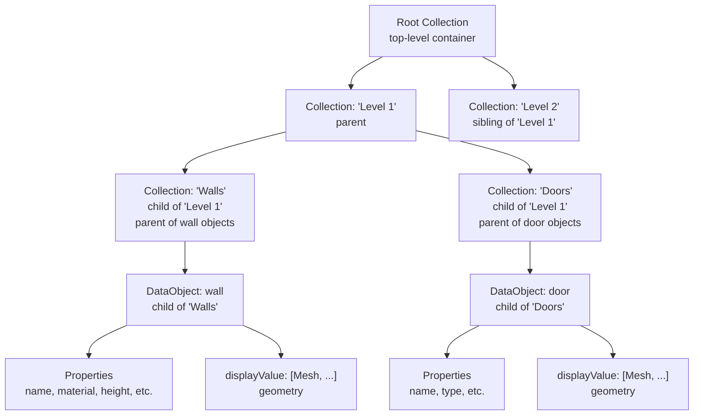
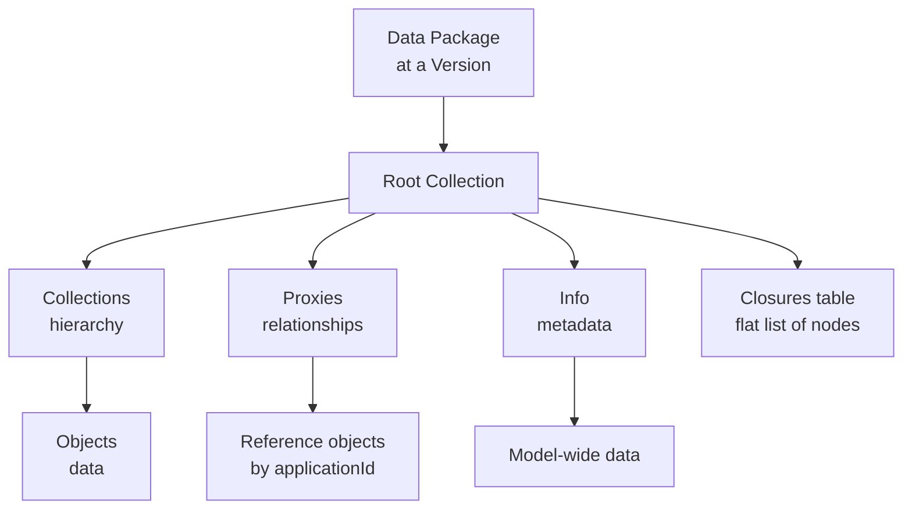

This page provides detailed explanations of the fundamental concepts that make up every Speckle data package, building from the most granular level upward. Here you'll learn how [Collections](/developers/data-schema/overview#core-glossary), [DataObjects](/developers/data-schema/overview#core-glossary), [Proxies](/developers/data-schema/overview#core-glossary), and [Info](/developers/data-schema/overview#core-glossary) work together to create a structured, traversable model without cycles. For a high-level overview, see the [Overview](/developers/data-schema/overview) page.

<Note title="Data Model vs Speckle Model">
The "Data Model" and "Speckle Model" refer to different concepts:

- **Data Model**: The structuring of properties, geometries, objects, collections, proxies, and info—the actual data structure at a version
- **Speckle Model**: An organizational container in the addressing system (Project → Model → Version)

When this documentation refers to "the data model" or "a data package", it's describing how properties, geometries, objects, collections, proxies, and info are structured together—the actual data that exists at a specific version address.

See the [Overview](/developers/data-schema/overview#projects-models-and-versions-as-addresses) for more on how Projects, Models, and Versions work as addresses.

</Note>

## Properties and Geometries

At the most granular level, the Data Model structures:

- **Properties**: Key-value pairs that store metadata and attributes (e.g., `name: "Wall 1"`, `material: "Concrete"`, `height: 3000`)
- **Geometries**: Geometric primitives that define shape and form (e.g., Point, Line, Curve, Mesh, Brep)

All properties and geometries are structured as **Base Objects**. The `Base` class is the foundation of the Data Model—every Speckle object inherits from Base.

A Base object is essentially a collection of properties that can be either:

- **Tightly typed (static)**: Properties defined in the class with type hints (e.g., `Point.x: float`, `Mesh.vertices: List[float]`)
- **Loosely typed (dynamic)**: Properties added at runtime without predefined types (e.g., `wall.customParameter = "value"`)

Base provides:

- **Identity**: Each object has a unique hash (object ID) based on its content
- **Property collection**: Combines tightly typed and loosely typed properties in a single object
- **Serialization**: Automatic conversion to/from JSON for storage and transport
- **Type information**: The `speckle_type` field identifies the object's type

_Why Base?_ This unified foundation means every Speckle object (geometry, data, collections) works the same way—same identity system, same serialization, same property model. This consistency makes the schema predictable and allows connectors to extend objects without breaking the core structure.

These are the atomic building blocks that combine to form objects.

## Detachment

**Detachment** is a core concept in Speckle that optimizes data transfer by storing large objects separately and referencing them by ID. When an object property is too large (e.g., a mesh with millions of vertices), the SDK automatically "detaches" it—storing the actual object separately and replacing it with a reference ID in the parent object.

In JSON, detached properties appear with an `@` prefix (e.g., `"@atomic_object_collection": "hash123..."`). The actual object is stored in the transport layer and automatically resolved when the data is received.

Key points:

- **Automatic**: Detachment happens automatically during serialization for large properties
- **Transparent**: References are automatically resolved during `receive()` operations
- **Efficient**: Prevents large objects from bloating JSON payloads
- **Deduplication**: Same object can be referenced multiple times without duplication

Detachment is distinct from **proxification** (see [Proxy Schema](/developers/data-schema/proxy-schema)):

- **Detachment**: Handles large individual objects (performance optimization)
- **Proxification**: Enables multiple overlapping organizational hierarchies (structural organization)

For detailed information on detachment, see the [original Speckle guide documentation](https://speckle.guide/user/detachable.html).

## Objects

**Objects** are the actual data elements in a data package. They're atomic, selectable elements that typically have a visual representation. Objects form the leaves of the tree structure—they contain the actual data and geometry, while Collections organize them.

There are three types of objects:

1. **Geometry** - A single piece of geometry (curve, mesh, brep, etc.) with minimal properties. These are pure geometric primitives that can exist standalone or within a DataObject's `displayValue`.
2. **DataObject** - A semantic object representing a BIM element or domain entity (wall, column, door) with rich properties and geometry stored in `displayValue`. DataObjects are the primary object type for BIM workflows.
3. **Instance** - An object that references a [Definition](/developers/data-schema/overview#core-glossary) proxy by `applicationId` and applies a transform, representing repeated geometry (blocks, components). Instances enable geometry reuse without duplication.

Every object has:

- An identity (`id` - content-based hash, `applicationId` - source application identifier)
- A type (`speckle_type` - identifies the object class)
- Properties (metadata and data - key-value pairs)
- Geometry (stored in `displayValue` for DataObjects - geometric primitives)

<Accordion title="What's the difference between Geometry and DataObject?">
  **Geometry** objects are primarily geometric primitives (Point, Line, Mesh, etc.) with minimal
  properties. **DataObject** objects are BIM elements that combine multiple geometries with rich
  properties (like a wall with material, dimensions, and type information). DataObjects typically
  contain multiple geometry objects in their `displayValue` array, along with extensive property
  data.
</Accordion>

## Collections

**Collections** are organizational containers that create hierarchy. They don't contain data themselves—they organize objects and other collections. Collections have an `elements` property that contains their child objects and nested collections, forming a parent-child relationship tree.

_Why separate collections from objects?_ This separation allows the same organizational structure (levels, categories, layers) to be preserved from source applications while keeping objects themselves flat and reusable. Objects can participate in multiple organizational systems via proxies without being duplicated.

The following diagram illustrates the parent-child relationship structure:

Key relationship rules:

- Collections contain objects and other collections (via `elements`)
- Each object or collection has exactly one parent collection (except Root Collection)
- The tree flows downward: Root Collection → Collections → Objects
- No object can be a child of another object (objects don't nest)

Nested collections typically represent organizational structures from the source application:

- **Revit**: File → Level → Category → Type
- **Rhino**: File → Layer → Sublayer
- **AutoCAD**: File → Layer

Collections can be nested to any depth, but most connectors use 2-4 levels.

### Root Collection

The **Root Collection** is always the top-level container for a data package at a version. It contains the collections hierarchy, proxies, info, and the closures table. It has no parent—it is the root of the tree.

The **closures table** (stored as `__closure`) provides a flat list of all nodes (objects and collections) that are descendants of the Root Collection. It serves as a shortcut to enable rapid processing—viewers, host applications, and deserializers can use it to quickly identify which objects need to be retrieved, then reassemble them as the hierarchy is loaded in. When data is sent using Speckle's serializers, the closures table is automatically created and populated.

<Note>
  Conceptually, the closures table is a dictionary where each key is a node ID (representing an
  object or collection) and each value represents the relative depth of that node in the tree
  structure.
</Note>

<Accordion title="Can collections contain other collections?">
  Yes! Collections can be nested to any depth. However, most connectors use a predictable pattern
  (2-4 levels) based on the source application's organizational structure. The nesting depth is
  determined by the connector, not by Speckle's data model.
</Accordion>

## Proxies

**Proxies** encode relationships between objects and shared resources. They allow objects to participate in multiple organizational systems without duplicating the objects themselves. Unlike Collections, which create a single hierarchical tree, Proxies create cross-cutting relationships that reference objects by their `applicationId`.

For example, a single wall DataObject can be:

- On "Level 1" (via a Level proxy)
- In "Exterior Walls" group (via a Group proxy)
- Using "Concrete" material (via a RenderMaterial proxy)

All without creating multiple copies of the wall.

Proxies are stored at the Root Collection level and reference objects by their `applicationId`, not their `id`. This allows relationships to persist even when object content changes.

_Why proxies?_ Real-world data has overlapping organizational needs—spatial (levels), functional (groups), visual (materials), and structural (definitions). If we only used collections, we'd have to choose one hierarchy or duplicate objects. Proxies solve this by storing relationships separately at the root level, allowing objects to participate in multiple systems simultaneously.

A special proxy type is the **Definition** proxy, which stores geometry for reuse by multiple **Instance** objects. This enables the instance-definition pattern common in CAD workflows (blocks, components).

<Accordion title="Why use proxies instead of just putting objects in collections?">
  Proxies solve the problem of **overlapping hierarchies**. A wall might belong to a level
  (spatial), a group (functional), and use a material (visual). If we only used collections, we'd
  have to choose one hierarchy or duplicate the wall. Proxies let us have all three relationships
  simultaneously without duplication.
</Accordion>

## Info

**Info** contains metadata that applies to the entire data package. This might include:

- **Views** - Camera objects from 3D views
- **Reference Point Transform** - Transform matrix for coordinate system adjustments
- **Analysis Results** - Data package-wide analysis data

Info fields are optional and connector-specific. Not all data packages have Info fields.

## Avoiding Cycles and Preserving Provenance

The tree structure ensures that the data model avoids cycles—you can traverse from Root Collection to any object without encountering circular references. This is achieved through strict parent-child relationships: each object or collection has exactly one parent, and objects don't nest within other objects (they're organized in collections).

Provenance—the ability to track where data came from and how it relates across versions—is preserved through `applicationId`. This stable identifier from the source application remains constant even when object content changes, enabling:

- Proxies to maintain relationships across versions
- Tracking of objects through model evolution
- Mapping back to source application elements

The tree structure doesn't require knowledge of directed acyclic graphs (DAGs) to understand—it's simply a hierarchy where each node has one parent, and traversal flows from root to leaves without cycles.

## How They Work Together

The hierarchy (Collections) organizes objects spatially or categorically. Proxies add additional relationships (materials, groups, levels) that cross-cut the hierarchy. Info provides context about the entire data package.

<Accordion title="Can I ignore proxies if I only care about the hierarchy?">
  Yes, for simple use cases you can traverse just the Collections to find Objects. However, you'll
  miss important relationships like material assignments, group memberships, and level associations
  that are encoded in proxies. Most real-world workflows need both. See the SDK documentation for
  traversal patterns and examples.
</Accordion>

## Conceptual Capability

After reading this page, you understand the fundamental building blocks of Speckle's data model: how Properties and Geometries form Base Objects, how Objects (Geometry, DataObject, Instance) represent data elements, how Collections create hierarchical organization, how Proxies encode cross-cutting relationships, and how Info provides package-wide metadata. You recognize that the tree structure prevents cycles while preserving provenance through stable identifiers. You're ready to examine the detailed structure of objects and their fields.

## Next Steps

Now that you understand the concepts, let's dive into the technical details:

- **[Object Schema](/developers/data-schema/object-schema)** - The structure and fields of objects
- **[Geometry Schema](/developers/data-schema/geometry-schema)** - How geometry is stored
- **[Proxy Schema](/developers/data-schema/proxy-schema)** - How proxies work in detail
