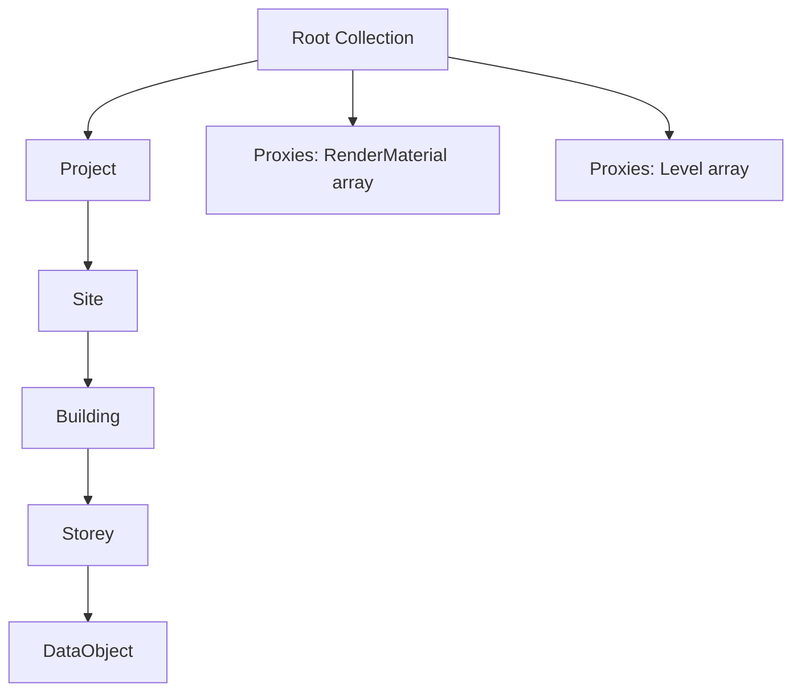

The IFC connector exports data from Industry Foundation Classes (IFC) files, preserving the IFC spatial structure.

## Hierarchy

IFC models follow the IFC spatial structure:



The hierarchy reflects IFC's spatial decomposition:

- **Project** - The IFC project
- **Site** - The site/building site
- **Building** - The building
- **Storey** - Building floor/level

## Object Type

IFC models use standard **DataObject** (not a connector-specific extension):

```json
{
  "id": "string",
  "speckle_type": "Objects.Data.DataObject",
  "applicationId": "string",
  "name": "string",
  "properties": {
    "string": "any value"
  },
  "displayValue": ["Base (geometry objects)"],
  "units": "string"
}
```

IFC elements are represented as DataObjects without connector-specific extensions. All IFC-specific data is in the `properties` field.

## Properties

DataObject `properties` contain IFC property set data:

- **IFC Property Sets** - IFC property set definitions (Pset\_\*)
- **IFC Type** - The IFC entity type (IfcWall, IfcDoor, etc.)
- **IFC GUID** - The IFC global unique identifier
- **IFC Attributes** - IFC entity attributes

```json
{
  "properties": {
    "IFC Type": "IfcWall",
    "IFC GUID": "3xKj$l5n1H5QvzJp7xH9$A",
    "IFC Attributes": {
      "GlobalId": "3xKj$l5n1H5QvzJp7xH9$A",
      "OwnerHistory": {...},
      "Name": "Basic Wall",
      "Description": null
    },
    "Property Sets": {
      "Pset_WallCommon": {
        "IsExternal": true,
        "LoadBearing": false,
        "FireRating": "2h"
      },
      "Pset_Construction": {
        "ConstructionMethod": "In-situ"
      }
    }
  }
}
```

## Proxies

IFC models use:

### RenderMaterial

Material assignments for visual representation. Referenced by objects via `applicationId`.

### Level

Level proxies encode IFC storey/level definitions. Objects reference levels via Level proxy `objects`.

## Example: IFC DataObject

```json
{
  "id": "ifc-abc123...",
  "speckle_type": "Objects.Data.DataObject",
  "applicationId": "ifc-guid-456",
  "name": "Basic Wall",
  "properties": {
    "IFC Type": "IfcWall",
    "IFC GUID": "3xKj$l5n1H5QvzJp7xH9$A",
    "IFC Attributes": {
      "GlobalId": "3xKj$l5n1H5QvzJp7xH9$A",
      "OwnerHistory": {...},
      "Name": "Basic Wall",
      "Description": null,
      "ObjectType": "Basic Wall",
      "ObjectPlacement": {...},
      "Representation": {...}
    },
    "Property Sets": {
      "Pset_WallCommon": {
        "IsExternal": true,
        "LoadBearing": false,
        "FireRating": "2h"
      },
      "Pset_Construction": {
        "ConstructionMethod": "In-situ",
        "Material": "Concrete"
      }
    }
  },
  "displayValue": [
    {
      "speckle_type": "Objects.Geometry.Mesh",
      "vertices": [0, 0, 0, 10, 0, 0, 10, 0, 3, 0, 0, 3, ...],
      "faces": [0, 1, 2, 0, 2, 3, ...],
      "units": "meters"
    }
  ],
  "units": "meters"
}
```

## Invariants and Caveats

1. **Standard DataObject** - IFC uses standard DataObject, not a connector-specific extension
2. **IFC spatial structure** - Hierarchy follows IFC's Project → Site → Building → Storey structure
3. **Property Sets** - IFC property sets are in `properties.Property Sets`
4. **IFC GUID** - The IFC global unique identifier is in `properties.IFC GUID` and `properties.IFC Attributes.GlobalId`
5. **No Info fields** - IFC models don't include Info fields
6. **IFC compliance** - Data structure follows IFC Data schema conventions

<Accordion title="How do I find elements by IFC type?">
  Filter DataObjects by `properties.IFC Type`. For example, to find all walls: filter where
  `properties.IFC Type == "IfcWall"`.
</Accordion>

<Accordion title="What's the difference between IFC GUID and applicationId?">
- **IFC GUID**: The IFC global unique identifier (format: `3xKj$l5n1H5QvzJp7xH9$A`)
- **applicationId**: Speckle's identifier for the object (may be the same as IFC GUID, but could be different)

Use IFC GUID for IFC-specific workflows. Use applicationId for Speckle references and proxies.

</Accordion>

## Related Documentation

- [Object Schema](/developers/data-schema/object-schema) - Base object structure
- [Proxy Schema](/developers/data-schema/proxy-schema) - How proxies work
