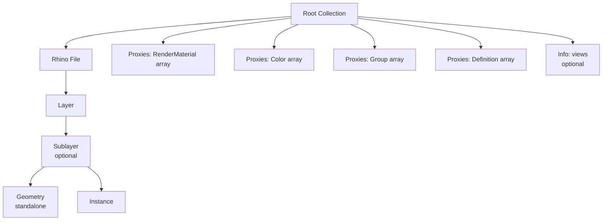

The Rhino connector exports geometry and objects from Rhino 3D, preserving layer organization and user data.

## Hierarchy

Rhino models are organized by File and Layer:



The hierarchy reflects Rhino's layer structure:
- **File** - The Rhino file
- **Layer** - Rhino layer
- **Sublayer** - Nested layer (if present)

## Object Types

Rhino exports three types of objects:

1. **Geometry** - Standalone geometry objects (Point, Line, Mesh, Brep, etc.)
2. **Instance** - Block references pointing to Definition proxies
3. **DataObject** - Objects with attached user data (less common)

### Geometry Objects

Standalone geometry objects can appear directly in collections:

```json
{
  "speckle_type": "Objects.Geometry.Mesh",
  "id": "...",
  "applicationId": "guid-123",
  "vertices": [...],
  "faces": [...],
  "units": "meters"
}
```

### Instance Objects

Instance objects reference Definition proxies:

```json
{
  "speckle_type": "Objects.Instance",
  "applicationId": "instance-guid",
  "definitionId": "block-guid",
  "transform": {
    "speckle_type": "Objects.Geometry.Matrix",
    "value": [1, 0, 0, 0, 0, 1, 0, 0, 0, 0, 1, 0, 10, 20, 30, 1]
  },
  "units": "meters"
}
```

## Properties

Geometry and Instance objects can have a `properties` field dynamically attached containing:

- **User Strings** - Key-value pairs stored on the object
- **User Dictionaries** - Nested dictionary data

```json
{
  "speckle_type": "Objects.Geometry.Mesh",
  "applicationId": "guid-123",
  "vertices": [...],
  "faces": [...],
  "properties": {
    "User Strings": {
      "Material": "Steel",
      "Thickness": "5mm"
    },
    "User Dictionaries": {
      "CustomData": {
        "Source": "Import",
        "Date": "2024-01-15"
      }
    }
  },
  "units": "meters"
}
```

## Proxies

Rhino models use these proxy types:

### RenderMaterial

Material assignments for visual representation.

### Color

Color assignments for objects. Referenced by objects via `applicationId`.

### Group

Group proxies encode Rhino group memberships. Objects can belong to multiple groups.

### Definition

Definition proxies store geometry for block instances. Referenced by Instance objects via `definitionId`.

## Info Fields

### views

An array of `Camera` objects from **named perspective views** in the Rhino file. These represent saved view configurations.

## Example: Rhino Geometry Object

```json
{
  "id": "mesh-abc123...",
  "speckle_type": "Objects.Geometry.Mesh",
  "applicationId": "rhino-guid-456",
  "vertices": [0, 0, 0, 10, 0, 0, 10, 10, 0, 0, 10, 0],
  "faces": [0, 1, 2, 0, 2, 3],
  "colors": [255, 128, 0, 255, 128, 0, 255, 128, 0, 255, 128, 0],
  "properties": {
    "User Strings": {
      "Material": "Aluminum",
      "Finish": "Anodized"
    }
  },
  "units": "meters"
}
```

## Example: Rhino Instance

```json
{
  "id": "instance-xyz789...",
  "speckle_type": "Objects.Instance",
  "applicationId": "instance-guid-789",
  "definitionId": "block-standard-door",
  "transform": {
    "speckle_type": "Objects.Geometry.Matrix",
    "value": [1, 0, 0, 0, 0, 1, 0, 0, 0, 0, 1, 0, 5, 10, 0, 1]
  },
  "units": "meters"
}
```

The corresponding Definition proxy:

```json
{
  "speckle_type": "Objects.Organization.Definition",
  "applicationId": "block-standard-door",
  "name": "Standard Door",
  "value": {
    "displayValue": [
      {
        "speckle_type": "Objects.Geometry.Mesh",
        "vertices": [...],
        "faces": [...]
      }
    ]
  },
  "objects": ["instance-guid-789", "instance-guid-790"]
}
```

## Invariants and Caveats

1. **Standalone geometry** - Geometry objects can exist directly in collections, not just in DataObject `displayValue`
2. **Instance/Definition pattern** - Block instances use the Instance/Definition proxy pattern
3. **Properties are optional** - Not all geometry objects have properties
4. **Layer organization** - Objects are organized by Rhino's layer structure
5. **User data in properties** - Rhino user strings and dictionaries appear in `properties` field

<AccordionGroup>
<Accordion title="How do I get the geometry for a block instance?">
Use the Instance's `definitionId` to find the corresponding Definition proxy, then access `proxy.value.displayValue` to get the geometry.
</Accordion>

<Accordion title="What's the difference between Color and RenderMaterial proxies?">
- **Color**: Simple color assignment (RGB values)
- **RenderMaterial**: Full material definition (color, opacity, metallic, roughness, etc.)
Rhino uses both because it supports both simple color assignments and full material definitions.
</Accordion>
</AccordionGroup>

## Related Documentation

- [Object Schema](/developers/data-schema/object-schema) - Base object structure
- [Geometry Schema](/developers/data-schema/geometry-schema) - Geometry storage
- [Proxy Schema](/developers/data-schema/proxy-schema) - How proxies work

