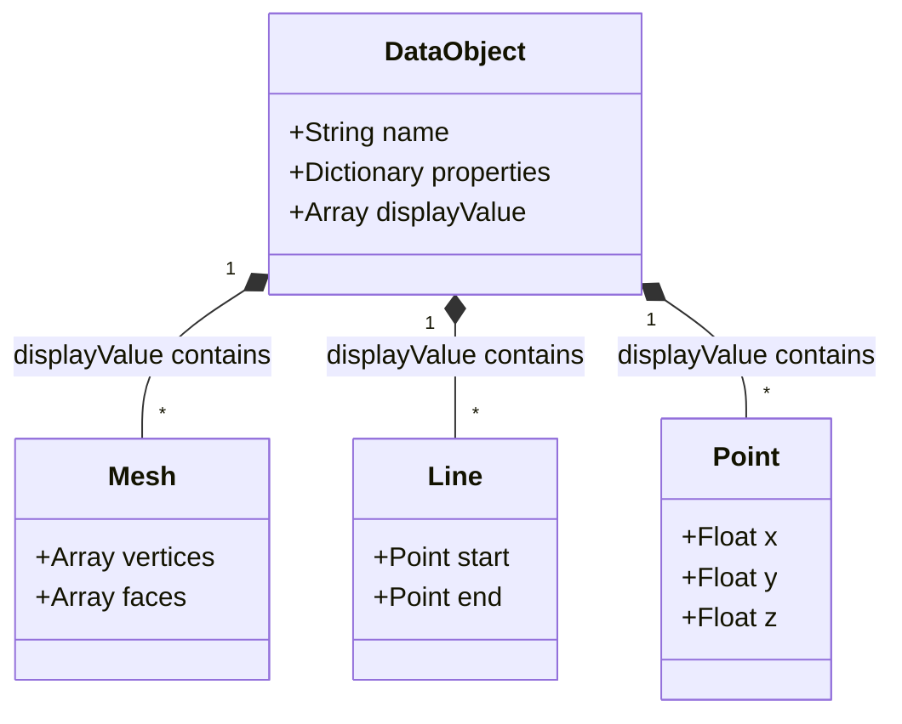
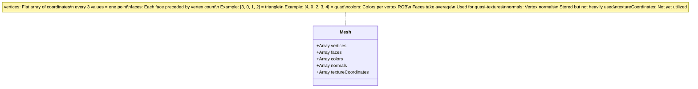
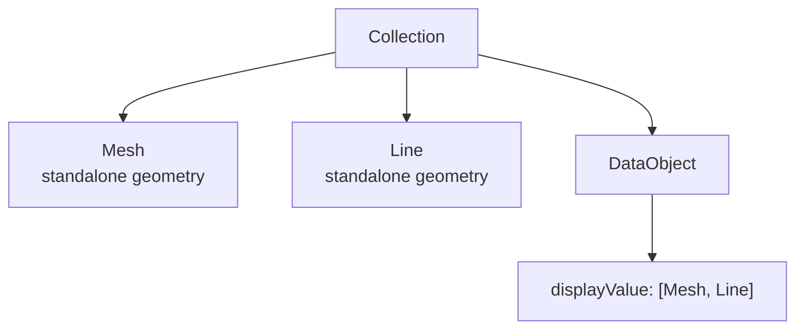
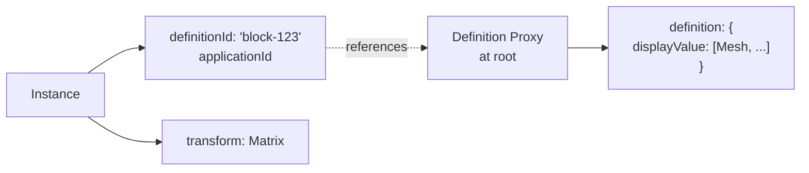

This page explains how geometry is structured and organized in Speckle's data model. Geometry in Speckle is always stored in the [`displayValue`](/developers/data-schema/overview#core-glossary) array of DataObjects as interoperable primitives. Here you'll learn how these primitives are composed, when geometry is "baked" (converted to primitives), how coordinate spaces work conceptually, and how geometry relates to object semantics.

## Geometry Storage Rule

All visual geometry for a DataObject must be in `displayValue`.:


Geometry objects are never direct children of DataObjects—they're always in `displayValue`.

*Why these primitives?* `displayValue` uses **minimum viable interoperable primitives** (Meshes, Lines, Points, etc.) that almost all AEC and 3D software can ingest, even if they don't understand higher-level concepts like "Wall" or "TopologicalSurface". This ensures maximum interoperability—a receiver application can always render the geometry, even if it can't interpret the DataObject's semantic meaning.

## Geometry Object Types

Speckle supports a wide range of geometry primitives:

### Basic Primitives
- **Point** - 3D point (x, y, z)
- **Line** - Line segment between two points
- **Polyline** - Connected line segments
- **Curve** - Parametric curve (NURBS, etc.)
- **Arc** - Circular arc
- **Circle** - Full circle
- **Ellipse** - Elliptical curve

### Surface Geometry
- **Mesh** - Triangulated surface (most basic), also supports quads and ngons; sent as hard-edged faces
- **Brep** - Boundary representation (solid or surface)

### Complex Geometry
- **Instance** - Reference to a Definition proxy with transform

## Geometry Object Structure

All geometry objects follow this pattern:

```json
{
  "id": "string",
  "speckle_type": "Objects.Geometry.Mesh",
  "applicationId": "string (optional)",
  "units": "string",
  "...geometry-specific fields..."
}
```

### Example: Mesh

A Mesh is composed of vertices (3D points) and faces (polygons connecting vertices). The most basic mesh is triangulated (composed of triangles), though Speckle also supports quads and ngons. The following diagram illustrates this structure:



Conceptually, a mesh is a surface composed of polygons where:
- **Vertices** define the 3D points in space
- **Faces** define polygons by referencing vertex indices, with each face preceded by its vertex count
- The mesh represents a surface through connected polygons (triangles are most common, but quads and ngons are supported)
- **Hard-edged faces**: Speckle does not implicitly normalize meshes—they are sent as hard-edged faces, preserving the exact geometry from the source application

Optional fields:
- **colors**: Colors are stored per vertex (RGB values). Faces take the average of their vertex colors, enabling quasi-texture mapping or visualization of analytical results (e.g., stress values, temperature gradients).
- **normals**: Vertex normals are supported but not heavily used in connectors due to lack of host application support.
- **textureCoordinates**: Not yet utilized in the current implementation.

```json
{
  "id": "mesh123...",
  "speckle_type": "Objects.Geometry.Mesh",
  "applicationId": "guid-456",
  "vertices": [0, 0, 0, 10, 0, 0, 10, 10, 0, 0, 10, 0],
  "faces": [3, 0, 1, 2, 3, 0, 2, 3],
  "colors": [255, 0, 0, ...],
  "textureCoordinates": [...],
  "units": "meters"
}
```

### Example: Point

```json
{
  "id": "point789...",
  "speckle_type": "Objects.Geometry.Point",
  "applicationId": "guid-012",
  "x": 5.0,
  "y": 10.0,
  "z": 2.5,
  "units": "meters"
}
```

## Multiple Geometry in displayValue

A single DataObject can have multiple geometry objects in `displayValue`:

```json
{
  "speckle_type": "Objects.Data.DataObject",
  "name": "Complex Element",
  "displayValue": [
    {
      "speckle_type": "Objects.Geometry.Mesh",
      "vertices": [...],
      "faces": [...]
    },
    {
      "speckle_type": "Objects.Geometry.Line",
      "start": {"x": 0, "y": 0, "z": 0},
      "end": {"x": 10, "y": 10, "z": 0}
    },
    {
      "speckle_type": "Objects.Geometry.Point",
      "x": 5, "y": 5, "z": 0
    }
  ]
}
```

This is common for:
- **Visual representation** (Mesh) + **Edge curves** (Line/Polyline)
- **Main geometry** + **Annotation geometry** (Points, Lines for dimensions)
- **Multiple LODs** (Level of Detail) - different representations for different purposes

<Accordion title="Why store geometry in an array instead of as direct properties?">
Using an array allows:
1. **Multiple representations** - The same object can have mesh, curves, and points
2. **Flexibility** - Different connectors can add different geometry types
3. **Consistency** - All geometry is accessed the same way (`obj.displayValue`)
4. **Traversal** - Easy to iterate over all geometry for an object

This design separates the object's identity and properties from its visual representation.
</Accordion>

## Geometry Units

Every geometry object has a `units` field indicating the unit system:

- `"m"` (most common)
- `"ft"`
- `"mm"`
- `"in"`

The `units` field should match the DataObject's `units` field. Always check units when processing geometry!

## Baked Geometry and Coordinate Spaces

**Baked geometry** refers to geometry that has been converted from high-level representations (NURBS surfaces, parametric curves, procedural geometry) into interoperable primitives (Meshes, Lines, Points). This conversion happens during the send process—connectors "bake" complex geometry into primitives that receivers can understand.

Conceptually, coordinate spaces work as follows:

- **Local coordinates**: Geometry in `displayValue` is typically in the local coordinate space of the DataObject. The DataObject's position and orientation in the model are determined by its placement in the collection hierarchy and any transforms applied.

- **World coordinates**: The complete model exists in a world coordinate space. To understand where geometry appears in the full model, you may need to:
  - Apply transforms from parent collections
  - Consider the Root Collection's reference point (if present in Info)
  - Account for coordinate system transformations

- **Units**: All coordinates are in the units specified by the `units` field. Always verify units before performing calculations or transformations.

**When is geometry baked?** Geometry is baked during the send process when connectors convert source application geometry into Speckle primitives. This ensures maximum interoperability—receivers don't need to understand NURBS, parametric surfaces, or other complex representations. They receive simple, renderable primitives.

## Geometry Primitives and Object Semantics

Geometry primitives in `displayValue` are **agnostic** to the semantic meaning of the DataObject. A Mesh in a wall's `displayValue` is just a mesh—it doesn't "know" it represents a wall. The semantic meaning comes from:
- The DataObject's `properties` (material, dimensions, type)
- The DataObject's `speckle_type` (e.g., "Objects.Data.DataObject:Objects.Data.RevitObject")
- The DataObject's position in the collection hierarchy

This separation enables:
- **Interoperability**: Receivers can render geometry even if they don't understand "Wall" semantics
- **Flexibility**: The same geometry primitives work across different applications
- **Clarity**: Geometry represents shape; properties represent meaning

For example, a wall DataObject might have:
- `properties.material = "Concrete"` (semantic: this is concrete)
- `displayValue = [Mesh with gray color]` (geometric: this is a gray surface)

The receiver can render the mesh without understanding walls, or can interpret the properties to understand it's a concrete wall.

## Pure Geometry Objects

Sometimes you'll encounter geometry objects that aren't in a DataObject's `displayValue`—they exist as standalone objects in collections. This is common in CAD workflows (Rhino, AutoCAD) where geometry is the primary data type.



Both patterns are valid. The key rule is: **if a DataObject has geometry, it's in `displayValue`**.

## Instances and Definitions

**Instance** objects reference geometry stored in Definition proxies:



This allows the same geometry to be reused multiple times with different transforms (like blocks in CAD).

## Geometry Processing Patterns

When processing geometry:

1. **Check `displayValue`** - Always look in `displayValue` for DataObjects
2. **Handle arrays** - `displayValue` is always an array, even if it has one item
3. **Check types** - Use `speckle_type` to determine geometry type
4. **Respect units** - Convert units if needed for your use case
5. **Handle empty arrays** - Some objects may have empty `displayValue` (data-only objects)

<Accordion title="What if displayValue is empty?">
Some DataObjects are data-only (no visual representation). They might represent:
- **Metadata objects** - Classification, properties only
- **Analytical elements** - Structural analysis data without geometry
- **Relationships** - Objects that encode relationships but have no geometry

Always check if `displayValue` exists and has items before processing geometry.
</Accordion>

## Conceptual Capability

After reading this page, you understand how geometry is structured in Speckle: how geometry primitives (Meshes, Lines, Points) are stored in `displayValue`, how meshes are composed of vertices and faces, when geometry is baked into primitives, how coordinate spaces work conceptually, and how geometry relates to object semantics. You recognize that geometry primitives are agnostic to semantic meaning—they represent shape, while properties represent meaning. You're ready to explore how proxies encode relationships between objects.

## Next Steps

- **[Proxy Schema](/developers/data-schema/proxy-schema)** - How proxies encode relationships
- **[Object Schema](/developers/data-schema/object-schema)** - Review object structure

