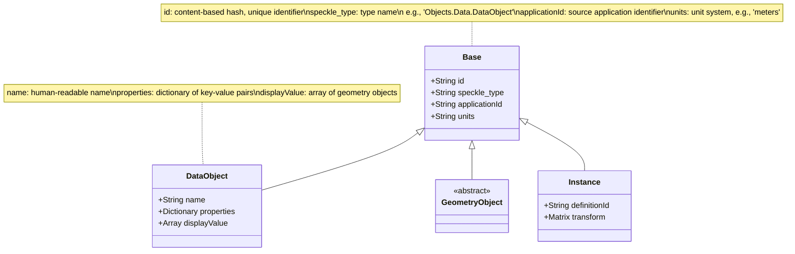
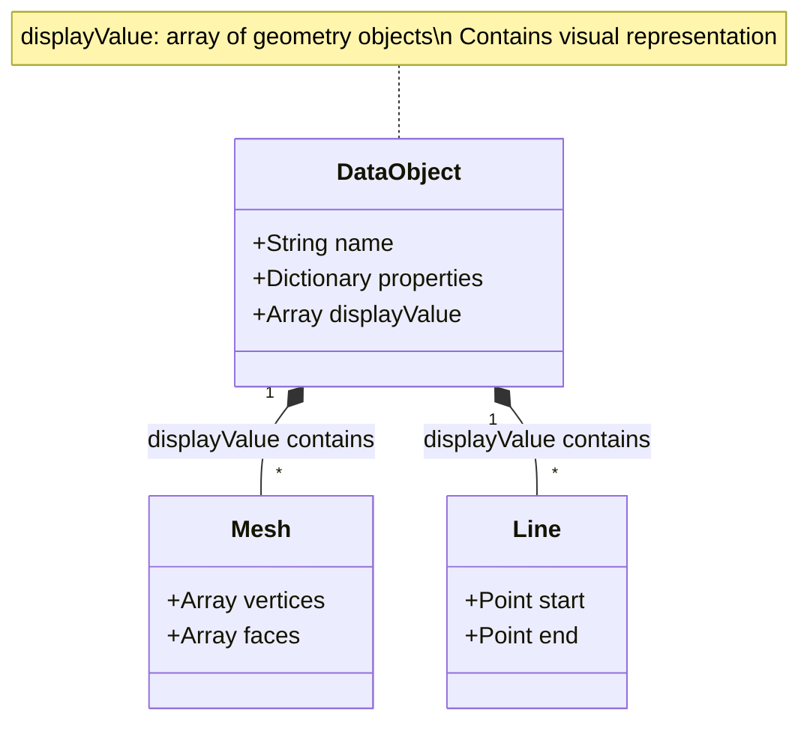

This page examines the detailed structure of objects in Speckle's data model. Here you'll learn how [DataObjects](/developers/data-schema/overview#core-glossary), Geometry objects, and Instances are shaped, what fields they contain, and how to interpret their properties and relationships. Every object in Speckle follows a consistent data model, regardless of which connector created it.

## Object Shape Overview

Every Speckle object has a consistent shape, regardless of type. Conceptually, an object looks like this:



This structure applies to all objects, though not all fields are present on all object types. Geometry objects have geometry-specific fields instead of `properties` and `displayValue`. Instance objects have a `definitionId` and `transform` instead.

## Base Object Fields

All Speckle objects inherit from `Base` and have these core fields:

```json
{
  "id": "string (hash-based, immutable)",
  "speckle_type": "string (type identifier)",
  "applicationId": "string (source application identifier)"
}
```

### `id`

The **`id`** is a content-based hash that uniquely identifies the object's data. If two objects have the same content, they have the same `id`. This enables efficient deduplication and version control.

### `speckle_type`

The **`speckle_type`** identifies what kind of object this is. Examples:

- `"Objects.Geometry.Point"`
- `"Objects.Geometry.Mesh"`
- `"Objects.Data.DataObject"`
- `"Objects.Data.DataObject:Objects.Data.RevitObject"`

### `applicationId`

The **`applicationId`** is the identifier from the source application (e.g., a Revit element ID, a Rhino object GUID). This is how proxies reference objects.

## DataObject Structure

**DataObject** is the most common object type for BIM elements. It extends `Base` with these fields:

```json
{
  "id": "string",
  "speckle_type": "Objects.Data.DataObject",
  "applicationId": "string",
  "name": "string",
  "properties": {
    "string": "any value"
  },
  "displayValue": ["Base (geometry objects)"],
  "units": "string"
}
```

### `name`

A human-readable name for the object (e.g., "Basic Wall - 200mm", "Column A1").

### `properties`

A dictionary of key-value pairs containing all metadata about the object. This is where connector-specific data lives:

- **Revit**: Instance parameters, type parameters, material quantities
- **Rhino**: User strings, user dictionaries
- **AutoCAD**: Extension dictionaries, XData

The `properties` dictionary can contain nested structures, but the values are always JSON-serializable.

**Role of properties**: Properties store semantic data—the "what" and "how" of an object (material, dimensions, classifications). They complement geometry stored in `displayValue`, which represents the "where" and "shape" of an object.

### `displayValue`

An array of geometry objects that represent the visual appearance of this DataObject. Geometry objects (Point, Line, Mesh, Brep, etc.) are stored here, not as direct children.



**Role of displayValue**: The `displayValue` array contains the geometric representation—the visual shape of the object. This is distinct from the semantic meaning stored in `properties`. A wall DataObject has properties describing it as a wall (material, dimensions, type), while `displayValue` contains the mesh geometry showing where and how it appears in 3D space.

**Distinction between DataObject, Semantic Object, and DisplayValue**:

- **DataObject** is the container—it combines semantic data (`properties`) with geometric representation (`displayValue`)
- **Semantic Object** refers to the domain meaning encoded in `properties` (e.g., "this is a wall with concrete material")
- **DisplayValue** is the geometric representation—the actual 3D geometry primitives that can be rendered

_Why `displayValue`?_ This keeps DataObjects flat as a best practice—geometry is stored separately in an array, allowing multiple representations (mesh + curves + points) while maintaining a simple object structure. More importantly, `displayValue` uses **minimum viable interoperable primitives** (Meshes, Lines, Points) that almost all AEC and 3D software can ingest, even if they have no concept of higher-level objects like "Wall" or "TopologicalSurface". This ensures maximum interoperability across different applications. Note that some DataObjects (like Revit curtain walls) may also have an `elements` property containing child DataObjects when required by the source application.

### `units`

The unit system used for this object's geometry (e.g., `"m"`, `"ft"`, `"mm"`, `"in"`).

## Geometry Object Structure

Geometry objects are simpler—they represent pure geometric primitives:

```json
{
  "id": "string",
  "speckle_type": "Objects.Geometry.Mesh",
  "applicationId": "string (optional)",
  "vertices": [...],
  "faces": [...],
  "units": "string"
}
```

Geometry objects don't have `properties` or `displayValue`—they are the geometry themselves.

## Instance Structure

**Instance** objects represent block references or instanced geometry:

```json
{
  "id": "string",
  "speckle_type": "Objects.Instance",
  "applicationId": "string",
  "definitionId": "string (applicationId of Definition proxy)",
  "transform": "Matrix (4x4 transformation)",
  "units": "string"
}
```

The `definitionId` references a Definition proxy that contains the actual geometry.

## Interpreting Absent or Optional Fields

When processing objects, you may encounter missing or optional fields. Here's how to interpret them:

- **Missing `displayValue`**: The object has no geometric representation—it's data-only (e.g., classification, metadata, analytical data). The object still has semantic meaning through `properties`.

- **Empty `displayValue` array**: Similar to missing—the object is intentionally data-only. Some connectors create objects for organizational or analytical purposes without geometry.

- **Missing `properties`**: Only applies to Geometry objects, which don't have a `properties` field. DataObjects always have `properties`, though it may be an empty dictionary.

- **Missing `applicationId`**: Some Geometry objects may not have an `applicationId` if they were created during conversion or processing. DataObjects should always have an `applicationId`.

- **Optional connector-specific fields**: Fields like `type`, `family`, `category` (on RevitObject) are connector-specific extensions. Their absence doesn't indicate an error—they're only present when the connector adds them.

**Best practice**: Always check for field existence before accessing it, and handle empty arrays and dictionaries gracefully.

## Global Invariants

These rules apply to all objects:

1. **No nested DataObjects (guideline)** - As a best practice, DataObjects should not contain other DataObjects as direct children. Use `displayValue` for geometry, and use proxies for relationships. _However, some connectors (e.g., Revit curtain walls, IFC data) may use an `elements` property to contain child DataObjects when the source application's structure requires it. Traversal code should anticipate and handle both patterns._

2. **Geometry always in `displayValue`** - All visual geometry for a DataObject must be in the `displayValue` array, not as direct properties.

3. **Objects always have core fields** - Every object has `id`, `speckle_type`, `applicationId`, `units`, and (for DataObjects) `properties`.

4. **Proxies reference by `applicationId`** - Proxies link to objects using `applicationId`, not `id`.

5. **Hierarchy is Speckle-imposed** - The collection hierarchy is created by Speckle connectors, not necessarily matching the source application's structure exactly.

<Accordion title="Why avoid nested DataObjects?">
As a best practice, DataObjects should not contain other DataObjects to prevent deep nesting and keep the data model flat and predictable. The tree structure works best with a clear parent-child relationship through collections. For most hierarchical relationships (like a wall containing studs), use:
1. Separate DataObjects in collections (spatial/categorical organization)
2. Proxies to encode the relationship (functional/material relationships)
3. Properties to store references (data-level relationships)

**However**, some connectors (like Revit curtain walls, IFC data) may use an `elements` property on DataObjects when the source application's structure requires it. **Your traversal code should handle both patterns**—check for `elements` properties on both Collections and DataObjects to ensure robust data processing.

</Accordion>

<Accordion title="What's the difference between `id` and `applicationId`?">
- **`id`**: Speckle's content-based hash. Same content = same `id`. Used for deduplication and content-based versioning.
- **`applicationId`**: The source application's identifier (Revit element ID, Rhino GUID, etc.). Used for references, proxies, and tracking objects across versions.

You use `applicationId` to track objects across versions (it's more stable—the same logical element keeps the same `applicationId` even if its content changes). You use `id` for deduplication and content-based lookups. Proxies reference objects by `applicationId`.

</Accordion>

## Connector-Specific Extensions

Some connectors extend DataObject with additional fields. For example:

- **RevitObject**: Adds `type`, `family`, `category`, `level`, `location`
- **NavisworksObject**: Minimal extension (just inherits DataObject)
- **Civil3dObject**: Adds `baseCurves`

These extensions are documented in the [connector pages](/developers/data-schema/connector-index).

## Example: Complete DataObject

Here's a realistic example of a Revit wall object:

```json
{
  "id": "a1b2c3d4e5f6...",
  "speckle_type": "Objects.Data.DataObject:Objects.Data.RevitObject",
  "applicationId": "12345",
  "name": "Basic Wall - 200mm",
  "properties": {
    "Volume": 12.5,
    "Area": 45.2,
    "Material": "Concrete",
    "Type Parameters": {
      "Width": 0.2,
      "Function": "Exterior"
    }
  },
  "displayValue": [
    {
      "speckle_type": "Objects.Geometry.Mesh",
      "vertices": [...],
      "faces": [...]
    }
  ],
  "type": "Basic Wall",
  "family": "Basic Wall",
  "category": "Walls",
  "level": "Level 1",
  "units": "meters"
}
```

## Conceptual Capability

After reading this page, you understand the structure of Speckle objects: how all objects inherit from Base with core identity fields, how DataObjects combine semantic data (`properties`) with geometric representation (`displayValue`), how Geometry objects represent pure primitives, and how Instance objects reference Definition proxies. You can interpret absent or optional fields and understand the distinction between semantic meaning and geometric representation. You're ready to explore how geometry is structured within `displayValue`.

## Next Steps

- **[Geometry Schema](/developers/data-schema/geometry-schema)** - How geometry objects are structured
- **[Proxy Schema](/developers/data-schema/proxy-schema)** - How proxies encode relationships
