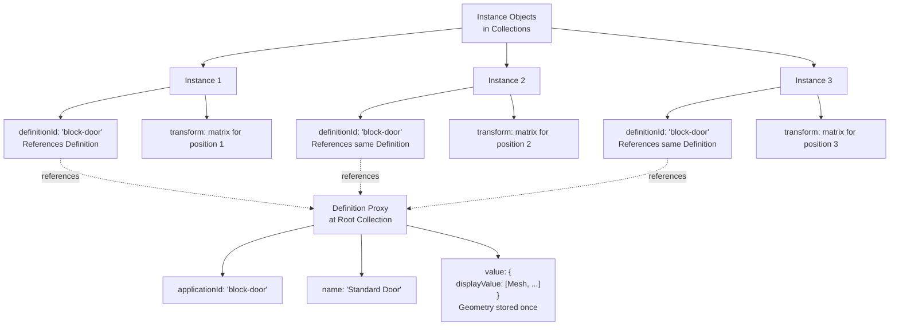
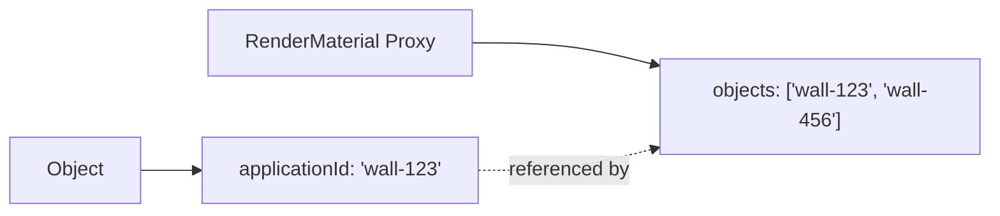
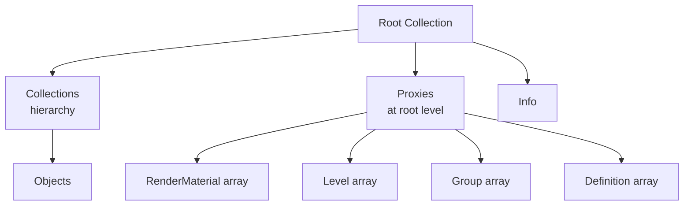
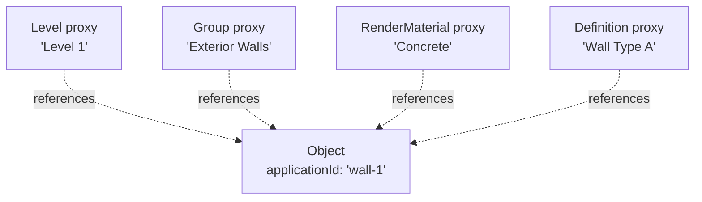

This page explains how [Proxies](/developers/data-schema/overview#core-glossary) encode relationships between objects and shared resources. Proxies solve a fundamental problem: how to let objects participate in multiple organizational systems without duplicating data. Here you'll learn how proxies reference objects, how [Definition](/developers/data-schema/overview#core-glossary) and [Instance](/developers/data-schema/overview#core-glossary) patterns work, how transforms propagate, and why proxies matter for deduplication, versioning, and performance.

## What Are Proxies?

**Proxies** are relationship containers stored at the Root Collection level. They encode connections between:
- Objects and shared resources (materials, levels, groups)
- Objects and other objects (group memberships, instance definitions)

Proxies allow a single object to be:
- On "Level 1" (spatial organization)
- In "Exterior Walls" group (functional grouping)
- Using "Concrete" material (visual property)
- Part of "Block A" definition (instance relationship)

All without creating multiple copies of the object.

## Proxy Structure

All proxies follow this pattern:

```json
{
  "speckle_type": "Objects.Organization.RenderMaterial",
  "applicationId": "material-123",
  "name": "Concrete",
  "value": {
    "color": [128, 128, 128],
    "opacity": 1.0
  },
  "objects": [
    "obj-app-id-1",
    "obj-app-id-2",
    "obj-app-id-3"
  ]
}
```

### Key Fields

- **`speckle_type`** - Identifies the proxy type
- **`applicationId`** - Unique identifier for this proxy
- **`name`** - Human-readable name
- **`value`** - The actual resource data (material, level, etc.)
- **`objects`** - Array of `applicationId`s of objects that use this resource

## Common Proxy Types

### RenderMaterial

Encodes material assignments:

```json
{
  "speckle_type": "Objects.Organization.RenderMaterial",
  "applicationId": "mat-concrete",
  "name": "Concrete",
  "value": {
    "color": [128, 128, 128],
    "opacity": 1.0,
    "metallic": 0.0,
    "roughness": 0.5
  },
  "objects": ["wall-1", "wall-2", "column-1"]
}
```

### Level

Encodes level/floor associations:

```json
{
  "speckle_type": "Objects.BuiltElements.Level",
  "applicationId": "level-1",
  "name": "Level 1",
  "value": {
    "elevation": 0.0,
    "name": "Level 1"
  },
  "objects": ["wall-1", "door-1", "window-1"]
}
```

### Group

Encodes group memberships:

```json
{
  "speckle_type": "Objects.Organization.Group",
  "applicationId": "group-exterior",
  "name": "Exterior Walls",
  "value": {
    "name": "Exterior Walls"
  },
  "objects": ["wall-1", "wall-2", "wall-3"]
}
```

### Definition

Stores geometry for instances (blocks, components). The following diagram illustrates how multiple [Instance](/developers/data-schema/overview#core-glossary) objects reference a single [Definition](/developers/data-schema/overview#core-glossary) proxy:



The Definition stores the geometry once; each Instance references it and applies its own transform. This enables geometry reuse without duplication.

```json
{
  "speckle_type": "Objects.Organization.Definition",
  "applicationId": "block-door",
  "name": "Standard Door",
  "value": {
    "displayValue": [
      {
        "speckle_type": "Objects.Geometry.Mesh",
        "vertices": [...],
        "faces": [...]
      }
    ]
  },
  "objects": ["instance-1", "instance-2", "instance-3"]
}
```

### Color

Encodes color assignments (CAD workflows):

```json
{
  "speckle_type": "Objects.Organization.Color",
  "applicationId": "color-red",
  "name": "Red",
  "value": {
    "hex": "#FF0000"
  },
  "objects": ["line-1", "line-2"]
}
```

## How Proxies Reference Objects

Proxies reference objects by **`applicationId`**, not `id`:



To find which objects use a material:
1. Get the RenderMaterial proxy
2. Read its `objects` array
3. Find objects with matching `applicationId`

To find which material an object uses:
1. Get the object's `applicationId`
2. Search all RenderMaterial proxies for one containing that `applicationId` in `objects`

<Accordion title="Why use applicationId instead of id for references?">
`applicationId` is stable within a model version and represents the source application's identifier. `id` is content-based and changes if the object's data changes. For relationships that should persist even when object data changes, `applicationId` is the right choice.

Also, `applicationId` is what the source application uses, making it easier to map back to the original data.
</Accordion>

## Proxy Location

All proxies are stored at the **Root Collection** level:



This centralized storage makes it easy to:
- Find all proxies of a type
- Resolve references efficiently
- Avoid duplication

## Multiple Relationships

A single object can be referenced by multiple proxies:



## Nested Proxies and Transform Propagation

**Nested proxies** occur when a Definition proxy's `value` contains objects that themselves reference other proxies. For example, a Definition might contain a DataObject that uses a RenderMaterial proxy.

Transform propagation works as follows:
- **Instance transforms** apply to the geometry stored in the Definition proxy
- When resolving an Instance, you:
  1. Find the Definition proxy by `definitionId` (using `applicationId`)
  2. Extract the geometry from `definition.value.displayValue`
  3. Apply the Instance's transform matrix to position/orient the geometry
- **Nested instances**: If a Definition contains Instances, transforms compose—the nested Instance's transform is applied relative to the parent Instance's transform

Conceptually, transforms flow from Instance → Definition → Geometry, positioning the geometry in world space based on the Instance's placement.

## Why Proxies Matter: Deduplication, Versioning, and Performance

Proxies provide three critical benefits:

**Deduplication**: Shared resources (materials, levels, definitions) are stored once and referenced many times. A single RenderMaterial proxy can reference hundreds of objects, avoiding duplication of material data. Similarly, a Definition proxy stores geometry once for many Instances.

**Versioning**: Because proxies reference objects by `applicationId` (which is stable across versions), relationships persist even when object content changes. A wall's material assignment remains linked even if the wall's geometry is modified.

**Performance**: Storing shared resources once reduces data size and transfer time. Instead of duplicating material properties on every object, a single proxy contains the material and references all objects that use it. This is especially important for Definition proxies—geometry stored once can be reused by many Instances without duplication.

These benefits make proxies essential for efficient, maintainable data models, especially in workflows with many repeated elements (blocks, components, shared materials).

## Connector-Specific Proxies

Different connectors use different proxy types:

- **Revit**: RenderMaterial, Level, Group
- **Rhino**: RenderMaterial, Color, Group, Definition
- **AutoCAD**: RenderMaterial, Color, Group, Definition
- **Civil3D**: RenderMaterial, Color, Group, Definition, PropertySetDefinition
- **Etabs**: Section, Material (specialized)

See [connector pages](/developers/data-schema/connector-index) for details.

## Reference Objects (Non-Proxy)

In addition to proxies, Speckle supports direct reference objects that point to other objects by ID. These are used for different purposes than proxies:

### ObjectReference

`ObjectReference` (deprecated as `Speckle.Core.Models.ObjectReference`, current type is `reference`) is a non-proxy reference object that directly references another object by its `id`:

```json
{
  "speckle_type": "reference",
  "referencedId": "object-hash-id"
}
```

Fields:
- **`referencedId`** (required) - The object `id` (hash) of the referenced object
- **`closure`** (optional) - Dictionary mapping closure information

Unlike proxies which reference by `applicationId` and are stored at root level, `ObjectReference` references by `id` and can appear anywhere in the object graph.

### InstanceProxy

`InstanceProxy` is a specialized proxy class for block/component instances (e.g., Rhino blocks, AutoCAD block references):

```json
{
  "speckle_type": "Speckle.Core.Models.Instances.InstanceProxy",
  "definitionId": "block-definition-app-id",
  "transform": [4x4 matrix],
  "units": "meters",
  "maxDepth": 10
}
```

Fields:
- **`definitionId`** (required) - The `applicationId` of the Definition proxy that contains the geometry
- **`transform`** (required) - 4x4 transformation matrix for the instance placement
- **`units`** (required) - Units of the host application file
- **`maxDepth`** (required) - Maximum depth for nested instance resolution

`InstanceProxy` objects are used to represent instances in the object graph. To get the geometry for an instance:
1. Get the `InstanceProxy` object
2. Use its `definitionId` to find the corresponding Definition proxy
3. Access `definition_proxy.value.displayValue` for the geometry

## Proxy Invariants

1. **Proxies are at root level** - Always stored in Root Collection, never nested
2. **References use applicationId** - Always `applicationId`, never `id`
3. **No circular references** - Proxies don't reference other proxies
4. **Value is the resource** - The `value` field contains the actual resource data
5. **objects is a list** - Can reference zero or more objects

<Accordion title="Can an object be in multiple groups?">
Yes! An object's `applicationId` can appear in multiple Group proxy `objects` arrays. This allows objects to belong to multiple functional groups simultaneously. The same applies to materials, levels, and other proxy types.
</Accordion>

## Conceptual Capability

After reading this page, you understand how Proxies encode relationships between objects and shared resources: how proxies reference objects by `applicationId`, how Definition and Instance patterns enable geometry reuse, how transforms propagate from Instances to geometry, and why proxies matter for deduplication, versioning, and performance. You recognize that proxies solve the overlapping hierarchies problem by storing relationships separately, allowing objects to participate in multiple organizational systems without duplication. You're ready to explore connector-specific behaviors and extensions.

## Next Steps

- **[Connector Index](/developers/data-schema/connector-index)** - Connector-specific proxy usage
- **[Object Schema](/developers/data-schema/object-schema)** - Review object structure

