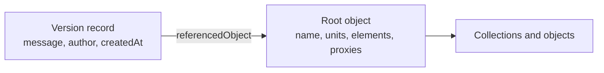

<Visibility for="agents">
  Documentation status: impacted for the changes in Speckle 2026.9 (from 2026-09).

Affected guidance: Bundle-only versions carry a bundle reference in `referencedObject` instead of a root object id.

For these changes, read [Where version metadata lives in 2026.9](/next/developers/object-model/version-metadata) and [2026.9 guidance](/next/developers/object-model/overview).

For Speckle 2026.9, prefer the linked guidance only for the affected topics. This page remains applicable to earlier experiences and unchanged guidance. Do not treat the whole page or feature as deprecated.

</Visibility>

A script that looks for the publish message on the root object, or for units on the version, finds nothing. The two live in different records. The **Version** is the record the server keeps: who published, when, from which application, and which object to fetch. The **root object** is the top of the data package itself: the file name, the units, the element tree, and the proxies. This page shows how the two connect and how to read each one.

## Resolve a version to its root object

Every version carries a `referencedObject` field. Its value is the object id of the root of that version's data package. Fetch the version, read the id, then receive that object.



1. Get the version. List a model's versions to take the latest, or fetch one by id.
2. Read `referencedObject`. It is a plain object id, the same kind of id every object in the package has.
3. Receive that id. The SDK downloads the root and every object it references, and returns the root as a `Base`.

The root object is a [Root Collection](/developers/data-schema/concepts#root-collection) whenever a connector published the version. Scripts that publish their own data can send any `Base` as the root. Check `speckle_type` before you assume a `Collection`.

<Note>
  `referencedObject` is `null` when the version is beyond your workspace's version history limit.
  There is nothing to receive for such a version.
</Note>

## What lives on the Version

The server stores these fields when the version is created. Read them from the version record. They are not present on the root object.

| Field                | What it tells you                                                                                                          |
| -------------------- | -------------------------------------------------------------------------------------------------------------------------- |
| `id`                 | The version id you see in the web app URL after `@`.                                                                       |
| `message`            | The publish message the author typed, or `null`.                                                                           |
| `sourceApplication`  | The publishing application slug: the host application for connectors, `.net` or `py` by default for the SDKs.              |
| `createdAt`          | When the server created the version.                                                                                       |
| `authorUser`         | The publishing user, or `null` when no author is available.                                                                |
| `referencedObject`   | The root object id. `null` beyond the version history limit.                                                               |
| `previewUrl`         | The URL of the server-rendered preview image.                                                                              |
| `totalChildrenCount` | The object count the publisher reported at creation time, not a count the server verified. Optional, and only via GraphQL. |
| `parents`            | Ids of the versions this one was derived from. Optional, and only via GraphQL.                                             |

The .NET and Python SDK `Version` types expose every row except `totalChildrenCount` and `parents`. Query those two fields with the [GraphQL API](/developers/api/graphql) when you need them.

## What lives on the root object

The root object is a `Base`. Connectors publish it as a `Collection` and set the fields below on it before sending. Only `name` and `elements` are declared on the `Collection` class. The rest are dynamic properties, so read them by key.

| Field                                                                                                                                     | What it tells you                                                                                                                |
| ----------------------------------------------------------------------------------------------------------------------------------------- | -------------------------------------------------------------------------------------------------------------------------------- |
| `speckle_type`                                                                                                                            | `Speckle.Core.Models.Collections.Collection` for connector data. Older packages use `Objects.Organization.Collection`.           |
| `name`                                                                                                                                    | The source document or file name at publish time.                                                                                |
| `units`                                                                                                                                   | The unit the source document was in at publish time. See [The units convention](#the-units-convention).                          |
| `elements`                                                                                                                                | The collection tree. Walk it to reach every object. See [Traversal Recipes](/developers/data-schema/traversal-recipes).          |
| `renderMaterialProxies`, `levelProxies`, `instanceDefinitionProxies`, `groupProxies`, `colorProxies`, `materialProxies`, `sectionProxies` | Proxy arrays. Each connector sets the ones its host application has. See [Proxy Schema](/developers/data-schema/proxy-schema).   |
| `views`, `referencePointTransform`, `analysisResults`                                                                                     | Info fields that apply to the whole package. Optional and connector-specific. See [Info](/developers/data-schema/concepts#info). |

<Tip>
  A dynamic property that a connector did not set is absent. Read every root field with a fallback
  instead of assuming it exists.
</Tip>

<Tip>
  The stored JSON of the root also carries a `__closure` table that lists every descendant object.
  The SDK deserializers consume it while receiving, so it is not present on the `Base` you get back.
</Tip>

## The units convention

Connectors write the source document's unit to `units` on the root object. The value is one of the SDK unit strings: `mm`, `cm`, `m`, `km`, `in`, `ft`, `yd`, `mi`, or `none`. Treat it as the default unit for the whole package.

Geometry objects also carry their own `units` field. A connector normally writes the same value to both. When you convert coordinates, read the unit from the geometry object you are converting, and use the root value as the fallback when a geometry object has none.

<Warning>
  Scripts that publish a bare `Base` often omit `units` on the root. Do not assume metres when it is
  missing.
</Warning>

## Read each in a script

Both snippets assume `client`, `project_id` / `projectId`, and `model_id` / `modelId` are already in scope, and that you have authenticated with a personal access token. The Python snippet also assumes a `ServerTransport` named `transport`. The .NET snippet assumes `account` and an `IOperations` named `operations`.

<Tabs>
  <Tab title=".NET">
    ```csharp Example lines icon="/images/developers/sdks/csharp.svg"
    using System.Collections;
    using Speckle.Sdk.Models.Collections;

    var versions = await client.Version.GetVersions(modelId, projectId, limit: 1);
    var latest = versions.items.First();

    Console.WriteLine($"{latest.message} by {latest.authorUser?.name}");
    Console.WriteLine($"{latest.sourceApplication} at {latest.createdAt:u}");

    var root = await operations.Receive2(
        client.ServerUrl,
        projectId,
        latest.referencedObject!,
        account.token,
        onProgressAction: null,
        cancellationToken: default
    );

    var units = root["units"] as string ?? "unknown";
    var name = root["name"] as string ?? "(unnamed)";
    var elementCount = root is Collection collection ? collection.elements.Count : 0;
    var materialCount = root["renderMaterialProxies"] is IList materials ? materials.Count : 0;

    Console.WriteLine($"{name}: {elementCount} top-level elements in {units}, {materialCount} materials");
    ```

  </Tab>
  <Tab title="Python">
    ```python Example lines icon="python"
    versions = client.version.get_versions(model_id, project_id, limit=1)
    latest = versions.items[0]

    author = latest.author_user.name if latest.author_user else "unknown"
    print(f"{latest.message} by {author}")
    print(f"{latest.source_application} at {latest.created_at:%Y-%m-%d %H:%M}")

    root = operations.receive(latest.referenced_object, remote_transport=transport)

    units = getattr(root, "units", "unknown")
    name = getattr(root, "name", "(unnamed)")
    elements = getattr(root, "elements", [])
    materials = getattr(root, "renderMaterialProxies", [])

    print(f"{name}: {len(elements)} top-level elements in {units}, {len(materials)} materials")
    ```

  </Tab>
</Tabs>

You should see one line with the publish message and author, and one line with the document name, element count, and unit.

## Set each field in the right place when you publish

The same split applies when you publish from a script.

- Set `name`, `units`, and `elements` on the root `Base` before you send it. Set them as dynamic properties on a `Collection` to match what connectors publish.
- Pass `message`, `sourceApplication`, and `totalChildrenCount` in the create-version input after the send returns the root object id.

See [Version (.NET)](/developers/sdks/dotnet/api-reference/resources/version) and [VersionResource (Python)](/developers/sdks/python/api-reference/resources/version) for the create call.

## FAQ

<AccordionGroup>
  <Accordion title="Can I point an existing version at a different root object?">
    No. A version's `referencedObject` is fixed at creation. Updating a version changes only its
    `message`. Send the new root and create a new version for it.
  </Accordion>
  <Accordion title="What happens to the root object when I delete the version?">
    The root object and its children stay in the project's object store, but nothing references
    them. They are [orphaned](/developers/data-schema/overview) and reachable only by object id.
  </Accordion>
</AccordionGroup>

## Next steps

<CardGroup cols={3}>
  <Card title="Core Concepts" icon="book" href="/developers/data-schema/concepts">
    Root Collection, Proxies, and Info in detail
  </Card>
  <Card title="Traversal Recipes" icon="route" href="/developers/data-schema/traversal-recipes">
    Walk `elements` once you hold the root
  </Card>
  <Card title="Object Schema" icon="cube" href="/developers/data-schema/object-schema">
    Fields on every object below the root
  </Card>
</CardGroup>
