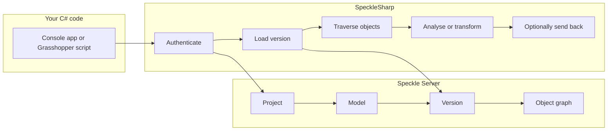

When you automate AEC workflows from C#, your code uses **SpeckleSharp** to talk to **Speckle Server**. Speckle Server stores **projects**, **models**, **versions**, and **objects** — structured model data instead of files.

**When to read this:** before deep dives into guides or API reference. **Read next:** [Build your first model analysis tool](/developers/sdks/dotnet/guides/build-your-first-model-analysis-tool) for a complete script, or [Load and publish model data](/developers/sdks/dotnet/concepts/send-and-receive-paths) to pick a send method.

## The mental model

```text
Your C# code  ──SpeckleSharp──►  Speckle Server
                                      │
                    ┌─────────────────┼─────────────────┐
                    ▼                 ▼                 ▼
               Workspace          Project            Model
                    │                 │                 │
                    │                 └────► Version ◄──┘
                    │                        │
                    │                        ▼
                    │                   Object graph
                    │              (walls, doors, rooms, meshes…)
                    ▼
```



## The recommended workflow

Most AEC automation scripts follow these steps:

1. **Authenticate** — personal access token from an environment variable (recommended for scripts)
2. **Choose a project and model** — IDs from the Speckle web app URL
3. **Load a version** — usually the latest published version on that model
4. **Traverse objects** — `Flatten()` or `GraphTraversal` over the received graph
5. **Analyse or transform data** — counts, QA checks, CSV export, custom logic
6. **Optionally send results back** — `Send2` plus `Version.Create` when you want a new published snapshot

<Tip>
The recommended approach for most AEC automation scripts: PAT via env var → `Receive2` latest version → `Flatten` → analyse → optional `Send2` + `Version.Create`.
</Tip>

## Platform concepts

Speckle organizes data as **projects → models → versions → object graphs**, not files. The GraphQL API exposes projects, models, and versions; `IOperations` moves object graphs to and from storage. Full hierarchy: [Data Schema Overview](/developers/data-schema/overview#projects-models-and-versions-as-addresses).

`IClient` exposes each level as a typed resource:

```csharp Example lines icon="/images/developers/sdks/csharp.svg"
var project = await client.Project.Create(new ProjectCreateInput("Office Renovation", null, ProjectVisibility.Private));
var model = await client.Model.Create(new CreateModelInput("Structural Model", null, project.id));
var version = await client.Version.Create(new CreateVersionInput(objectId, model.id, project.id, "Updated beam sizing"));
```

<Info>
Some lower-level APIs (transports, `Send`/`Receive`) still use `streamId` for what the GraphQL API calls `projectId`. Pass your project's `id` — they are the same value.
</Info>

Object modeling (`Base`, `DataObject`, `Collection`, detachment, `displayValue`): [Work with model objects](/developers/sdks/dotnet/concepts/objects-and-traversal).

## Object IDs (hashes)

Every sent object has a unique **object ID**, deterministically generated from its content.

<Warning>
`Base.GetId()` is obsolete and does not match the IDs produced by every send path. Always use the ID returned by the send operation you actually called (`Operations.Send`, `Send2`, or `SendPipeline`) rather than computing it separately.
</Warning>

## Load and publish model data

`IOperations` provides the core methods for moving object graphs. See [Load and publish model data](/developers/sdks/dotnet/concepts/send-and-receive-paths) for when to use which entry point.

For scripts and notebooks, **`Receive2`/`Send2`** is the recommended choice. The [Full send/receive tour](/developers/sdks/dotnet/getting-started/quickstart) teaches the classic `Send`/`Receive` + `ServerTransport` pair if you want to understand transports:

```csharp Example lines icon="/images/developers/sdks/csharp.svg"
using var transport = provider.GetRequiredService<IServerTransportFactory>().Create(client.Account, project.id);

var (objectId, _) = await operations.Send(myData, transport, useDefaultCache: true);
var received = await operations.Receive(objectId, remoteTransport: transport);
```

## Orphaned objects

<Warning>
Objects sent to the server but not referenced by any version are **orphaned** — stored with an object ID but unreachable through the Speckle UI until a version references them.
</Warning>

```csharp Example lines icon="/images/developers/sdks/csharp.svg"
var (objectId, _) = await operations.Send(myData, transport, true);
// Without creating a version, this object is orphaned

var version = await client.Version.Create(new CreateVersionInput(objectId, model.id, project.id, "My data"));
```

Always create a version after sending data you want users to find.

## The type system

Every object carries a `speckle_type`, derived from its .NET type, which lets `Receive` reconstruct the correct concrete type:

```csharp Example lines icon="/images/developers/sdks/csharp.svg"
using Speckle.Objects.Geometry;
using Speckle.Sdk.Common;

var point = new Point(1, 2, 3, Units.Meters);
Console.WriteLine(point.speckle_type); // "Objects.Geometry.Point"
```

<Info>
Custom types and traversal: [Work with model objects](/developers/sdks/dotnet/concepts/objects-and-traversal). Geometry types: [Working with Geometry](/developers/sdks/dotnet/guides/working-with-geometry).
</Info>

## Local cache

Speckle.Sdk maintains a local SQLite cache under the current user's application data folder (`.../Speckle/`), used automatically by `Send`/`Receive` when `useDefaultCache: true`.

## FAQ

<AccordionGroup>
  <Accordion title="What happens if I send data but never create a version?">
    The object is stored on the server with an object ID, but it is **orphaned** until a version references it. Always create a version after sending data you want others to find.
  </Accordion>
  <Accordion title="Should I use Send or Send2?">
    Use **Send2**/`Receive2` for scripts, notebooks, and most new server-facing code. Use **Send**/`Receive` with an `ITransport` when you follow the [Full send/receive tour](/developers/sdks/dotnet/getting-started/quickstart), need `MemoryTransport`/`SQLiteTransport`, or integrate with code that already uses transports. See [Load and publish model data](/developers/sdks/dotnet/concepts/send-and-receive-paths).
  </Accordion>
  <Accordion title="Why does streamId appear in transport code?">
    Older transport APIs use `streamId` for what the GraphQL API calls `projectId`. Pass your project's `id` — they are the same value.
  </Accordion>
</AccordionGroup>

## Next Steps

<CardGroup cols={3}>
  <Card title="Build your first model analysis tool" icon="chart-bar" href="/developers/sdks/dotnet/guides/build-your-first-model-analysis-tool">
    Load, traverse, and export a CSV report
  </Card>
  <Card title="Load and publish model data" icon="route" href="/developers/sdks/dotnet/concepts/send-and-receive-paths">
    Choose Send2, Send, or SendPipeline
  </Card>
  <Card title="Operations API" icon="code" href="/developers/sdks/dotnet/api-reference/operations">
    Send, Receive, and Send2 signatures
  </Card>
</CardGroup>
