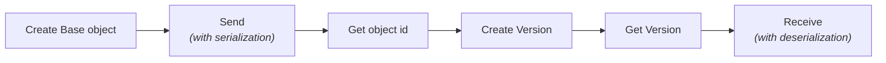

## The Speckle Data Model

Speckle uses an **object-based** approach rather than a file-based one — data lives as individual objects, transferred incrementally, with built-in version control.

<Info>
This page covers the .NET-specific mental model: the `Client`, `Operations`, and how they map onto Speckle's platform concepts. For the language-agnostic structure of that data — Collections, DataObjects, Proxies — see [Data Schema Overview](/developers/data-schema/overview).
</Info>

## Projects, Models, and Versions

Speckle organizes data in a three-level hierarchy:

```
Project
  └─ Model
      └─ Version
          └─ Object (root object + children)
```

`IClient` exposes each level as a typed resource:

```csharp
// Projects are top-level containers for related work
var project = await client.Project.Create(new ProjectCreateInput("Office Renovation", null, ProjectVisibility.Private));

// Models are branches within a project (e.g. "structural", "MEP")
var model = await client.Model.Create(new CreateModelInput("Structural Model", null, project.id));

// Versions are immutable snapshots referencing a sent object by its id
var version = await client.Version.Create(new CreateVersionInput(objectId, model.id, project.id, "Updated beam sizing"));
```

<Info>
Projects replace what used to be called "Streams" in prior versions of Speckle — some lower-level APIs (transports, `Send`/`Receive`) still use `streamId` as a parameter name for what is now the project ID.
</Info>

## Object IDs (Hashes)

Every sent object has a unique **object ID**, deterministically generated from its content. Identical content produces the identical ID, which enables deduplication and incremental sync.

<Warning>
`Base.GetId()` is obsolete and does not match the IDs produced by every send path. Always use the ID returned by the send operation you actually called (`Operations.Send`, `Send2`, or `SendPipeline`) rather than computing it separately.
</Warning>

## Operations: Send and Receive

`IOperations` provides the core methods for moving object graphs to and from storage. There are several distinct entry points — see [Send and Receive Paths](/developers/sdks/dotnet/concepts/send-and-receive-paths) for when to use which. The simplest, most common pair:

```csharp
using var transport = provider.GetRequiredService<IServerTransportFactory>().Create(client.Account, project.id);

// Send returns the object id and a map of converted references
var (objectId, _) = await operations.Send(myData, transport, useDefaultCache: true);

// Receive reconstructs the object graph from an id
var received = await operations.Receive(objectId, remoteTransport: transport);
```

<Info>
`Send` automatically handles serialization, child object detection, chunking of large arrays, deduplication, and parallel uploads.
</Info>

## Orphaned Objects

<Warning>
Objects sent to the server but not referenced by any version are "orphaned" or "zombie" objects. They exist in the database and have an object ID, but are effectively unreachable through the normal Speckle UI or workflows.
</Warning>

```csharp
// This object is sent but becomes orphaned until a version references it
var (objectId, _) = await operations.Send(myData, transport, true);
// ⚠️ Without creating a version, this object is a "zombie"

var version = await client.Version.Create(new CreateVersionInput(objectId, model.id, project.id, "My data"));
// Now reachable via this version
```

Always create a version after sending data you want users to be able to find.

## The Object Lifecycle



<Steps>
  <Step title="Create">
    Build a `Base`-derived object graph.
  </Step>
  <Step title="Send">
    Send it via `IOperations.Send` and a transport.
  </Step>
  <Step title="Version">
    Create a version referencing the returned object id.
  </Step>
  <Step title="Get Version">
    Retrieve the version to read its `referencedObject`.
  </Step>
  <Step title="Receive">
    Receive the object graph by id.
  </Step>
</Steps>

## The Type System

Every object carries a `speckle_type`, derived automatically from its .NET type, which lets `Receive` reconstruct the correct concrete type instead of a generic `Base`:

```csharp
using Speckle.Objects.Geometry;

var point = new Point(1, 2, 3, "m");
Console.WriteLine(point.speckle_type); // "Objects.Geometry.Point"
```

<Info>
For custom types, see [Objects and Traversal](/developers/sdks/dotnet/concepts/objects-and-traversal). For built-in geometry types, see [Working with Geometry](/developers/sdks/dotnet/guides/working-with-geometry).
</Info>

## Local Cache

Speckle.Sdk maintains a local SQLite cache under the current user's application data folder (`.../Speckle/`), used automatically by `Send`/`Receive` when `useDefaultCache: true` — reducing network transfers and enabling offline work with previously received data.

## Next Steps

<CardGroup cols={2}>
  <Card title="Dependency Injection" icon="cubes" href="/developers/sdks/dotnet/concepts/dependency-injection">
    What AddSpeckleSdk registers, and why
  </Card>
  <Card title="Objects and Traversal" icon="cube" href="/developers/sdks/dotnet/concepts/objects-and-traversal">
    Deep dive into the Base class and the object graph
  </Card>
  <Card title="Send and Receive Paths" icon="route" href="/developers/sdks/dotnet/concepts/send-and-receive-paths">
    Choose the right pathway for your workflow
  </Card>
  <Card title="API Reference" icon="code" href="/developers/sdks/dotnet/api-reference/client">
    Client, resources, and Operations API
  </Card>
</CardGroup>
