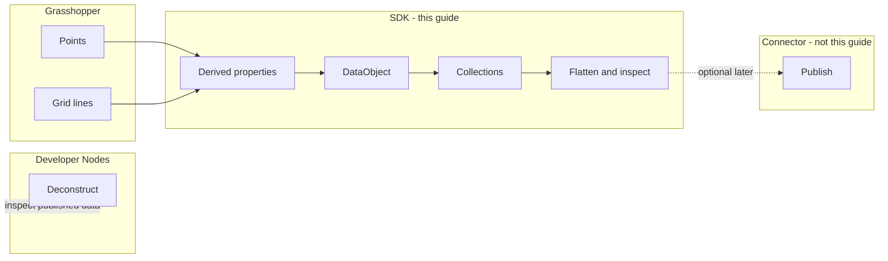

This guide teaches building Speckle object graphs inside Grasshopper — computed metadata, nested collections, and local inspection — without publishing to a server first.

**When to use it:** enrich Grasshopper geometry with SDK types before or alongside the connector. **Read next:** [Grasshopper Objects](/connectors/grasshopper/grasshopper-objects) for connector basics, then [Work with model objects](/developers/sdks/dotnet/concepts/objects-and-traversal).

## When to use the SDK vs connector components

The Speckle Grasshopper connector (Publish, Load, passthrough nodes) is the right tool for **moving data** to and from Speckle. SpeckleSharp in a C# Script is the right tool when you need:

- **Custom analysis** that connector nodes do not provide
- **Extracting or restructuring** model data programmatically
- **Creating reports** with computed fields derived from geometry
- **Combining Speckle data** with Grasshopper logic in one pass
- **Prototyping workflows** before turning them into a plugin or automation

Use connector nodes for transport. Use the SDK for construction, enrichment, and analysis. The SDK does **not** replace Publish and Load — it complements them.

|          | Grasshopper Speckle components                 | Speckle.Sdk in a C# Script                                             |
| -------- | ---------------------------------------------- | ---------------------------------------------------------------------- |
| Role     | **Move** data                                  | **Construct, enrich, analyse** data                                    |
| Examples | Publish, Load, passthrough params, Deconstruct | `DataObject` + derived `properties`, `Collection` hierarchy, `Flatten` |

## When connector nodes are enough

Passthrough nodes move and lightly edit data on wires. They do not execute graph-wide computation, derive per-element metadata from geometry, or assemble nested collections from grouping rules. **Deconstruct** inspects one param at a time; **Speckle.Sdk** constructs and analyses the whole graph; **Publish** exchanges it.

## Ecosystem progression

```
Developer Nodes     →  SDK (this guide)  →  Publish / Load
inspect             construct, enrich     exchange
```

| Layer         | Tool                                                                           | Role                                                                                                                     |
| ------------- | ------------------------------------------------------------------------------ | ------------------------------------------------------------------------------------------------------------------------ |
| **Inspect**   | [Developer Nodes](/connectors/grasshopper/grasshopper-developer) — Deconstruct | See what is on a wire; one object at a time                                                                              |
| **Construct** | **Speckle.Sdk in C# Script** — **this guide**                                  | Build graphs, computed metadata, hierarchy, traverse at scale                                                            |
| **Exchange**  | Publish / Load                                                                 | Move data to and from Speckle — [Grasshopper connector](/connectors/grasshopper/grasshopper); not taught in the main arc |



Solid lines = main guide. Dotted = ecosystem / appendix only.

<Frame>

</Frame>

## Mission and when you need the SDK

Passthrough nodes move geometry and attach **static** attributes. They do not run graph-wide computation or build nested structures from rules. The use cases above cover when to reach for Speckle.Sdk in a C# Script.

<Info>
The same workflow applies to room footprints (`floorArea`, `occupancy`, `carbonEstimate`, `qaStatus`) or any case where **per-element computed fields** do not scale on wires.
</Info>

## Prerequisites

- Rhino 8 and a Grasshopper **C# Script** component (**Maths** > **Script**)
- Familiarity with [Developer Nodes](/connectors/grasshopper/grasshopper-developer) — especially **Deconstruct** for the inspect layer
- Awareness that **Publish** exists on the connector (exchange layer) — not required to complete this exercise
- [DataObject and Collection](/developers/sdks/dotnet/concepts/objects-and-traversal#dataobject-and-collection) — the containers this guide builds

## Set up the C# Script component

Add a C# Script to your canvas and declare these inputs and outputs. Geometry comes from Grasshopper; **Speckle-facing metadata is computed in the script**, not wired in as static lists.

| In / out       | Type            | Role                                     |
| -------------- | --------------- | ---------------------------------------- |
| `pts`          | `List<Point3d>` | Pier or footing locations                |
| `gridLines`    | `List<Line>`    | Closest-line index for `nearestGridLine` |
| `capacity`     | `double`        | Denominator for `utilization`            |
| `elementCount` | `int`           | Count after `Flatten`                    |
| `summary`      | `string`        | Report of computed fields                |
| `status`       | `string`        | Validation message                       |

Do not add `category` or `loads` as dumb inputs — those values are **derived** in code.

## Install packages and minimal bootstrap

Install NuGet packages from the C# Script editor (**box icon** > **Specify Package(s)**). Copy the `#r` lines from the [Speckle.Sdk](https://www.nuget.org/packages/Speckle.Sdk) and [Speckle.Objects](https://www.nuget.org/packages/Speckle.Objects) **Script & Interactive** tabs (version numbers will match the latest release):

```csharp NuGet references lines icon="/images/developers/sdks/csharp.svg"
// Grasshopper C# Script — NuGet references
#r "nuget: Speckle.Sdk, 3.21.1"
#r "nuget: Speckle.Objects, 3.21.1"
```

Paste a minimal bootstrap once per script. It registers the object model and gives you `Flatten` helpers plus optional `Serialize` — **no account or `IClientFactory` required** for the main exercise:

```csharp Bootstrap lines icon="/images/developers/sdks/csharp.svg"
using Microsoft.Extensions.DependencyInjection;
using Speckle.Sdk;
using Speckle.Sdk.Api;

static class SpeckleBootstrap
{
    static readonly ServiceProvider Provider = new ServiceCollection()
        .AddSpeckleSdk(
            new Application("GH Enrichment", "gh-enrichment"),
            "1.0.0",
            typeof(Speckle.Objects.Geometry.Point).Assembly
        )
        .BuildServiceProvider();

    public static IOperations Operations => Provider.GetRequiredService<IOperations>();
}
```

<Tip>
The Grasshopper connector converts Rhino points the same way — see [`PointToSpeckleConverter.cs`](https://github.com/specklesystems/speckle-sharp-connectors/blob/main/Converters/Rhino/Speckle.Converters.RhinoShared/ToSpeckle/Raw/PointToSpeckleConverter.cs) in speckle-sharp-connectors.
</Tip>

## Grasshopper execution model

Grasshopper recomputes the script whenever upstream inputs change. Building a `Collection` of a few hundred `DataObject` instances is cheap — there is **no network call** in the main exercise.

On large lists, cache the `summary` string in a script field and only rebuild it when `pts` count changes, so preview panels stay responsive. The object graph itself should still rebuild each solve so outputs stay correct.

## Enrich a structural layout

**Worked example:** build a publish-ready structural data model from pier locations and grid lines. Inputs are geometry only; every Speckle property below is **computed**.

| Computed property    | Derivation                                                                     |
| -------------------- | ------------------------------------------------------------------------------ |
| `distanceFromOrigin` | `pt.DistanceTo(origin)`                                                        |
| `quadrant`           | Sign of X and Y relative to origin                                             |
| `bearing`            | `Atan2` converted to degrees                                                   |
| `utilization`        | Simplified demand / `capacity` (replace with upstream analysis when available) |
| `nearestGridLine`    | Index of closest line in `gridLines`                                           |

### Complete example


```csharp Complete example lines icon="/images/developers/sdks/csharp.svg" expandable
// Grasshopper C# Script — structural layout enrichment
#r "nuget: Speckle.Sdk, 3.21.1"
#r "nuget: Speckle.Objects, 3.21.1"

using System;
using System.Collections.Generic;
using System.Linq;
using System.Text;
using Microsoft.Extensions.DependencyInjection;
using Rhino.Geometry;
using Speckle.Objects.Data;
using Speckle.Objects.Geometry;
using Speckle.Sdk;
using Speckle.Sdk.Api;
using Speckle.Sdk.Common;
using Speckle.Sdk.Models;
using Speckle.Sdk.Models.Collections;
using Speckle.Sdk.Models.Extensions;

static class SpeckleBootstrap
{
    static readonly ServiceProvider Provider = new ServiceCollection()
        .AddSpeckleSdk(
            new Application("GH Enrichment", "gh-enrichment"),
            "1.0.0",
            typeof(Point).Assembly
        )
        .BuildServiceProvider();

    public static IOperations Operations => Provider.GetRequiredService<IOperations>();
}

private void RunScript(
    List<Point3d> pts,
    List<Line> gridLines,
    double capacity,
    ref object elementCount,
    ref object summary,
    ref object status)
{
    if (pts == null || pts.Count == 0)
    {
        status = "Provide at least one point.";
        elementCount = 0;
        summary = "";
        return;
    }

    var origin = Point3d.Origin;
    var dataObjects = pts.Select((pt, i) => BuildFooting(pt, i, origin, gridLines, capacity)).ToList();
    var root = BuildRootByQuadrant(dataObjects);

    var flat = root.Flatten().ToList();
    elementCount = flat.Count;
    summary = BuildSummary(dataObjects);
    status = "OK";
}

static DataObject BuildFooting(Point3d pt, int index, Point3d origin, List<Line> gridLines, double capacity)
{
    var dx = pt.X - origin.X;
    var dy = pt.Y - origin.Y;
    var distance = pt.DistanceTo(origin);
    var bearing = Math.Round(Math.Atan2(dy, dx) * (180.0 / Math.PI), 1);
    var demand = distance * 10.0; // stand-in; pipe real analysis from upstream when available
    var utilization = capacity > 0 ? Math.Round(demand / capacity, 3) : 0;

    var specklePoint = new Point(pt.X, pt.Y, pt.Z, Units.Meters);

    return new DataObject
    {
        name = $"Footing {index + 1}",
        properties = new Dictionary<string, object?>
        {
            ["distanceFromOrigin"] = Math.Round(distance, 3),
            ["quadrant"] = Quadrant(dx, dy),
            ["bearing"] = bearing,
            ["utilization"] = utilization,
            ["nearestGridLine"] = NearestGridLineIndex(pt, gridLines),
        },
        displayValue = new List<Base> { specklePoint },
    };
}

static Collection BuildRootByQuadrant(List<DataObject> footings)
{
    var root = new Collection { name = "Structural layout" };

    foreach (var group in footings.GroupBy(f => f.properties["quadrant"] as string ?? "Unknown"))
    {
        var quadrantCollection = new Collection { name = group.Key };
        quadrantCollection.elements.AddRange(group.Cast<Base>());
        root.elements.Add(quadrantCollection);
    }

    return root;
}

static string Quadrant(double dx, double dy)
{
    if (dx >= 0 && dy >= 0) return "NE";
    if (dx < 0 && dy >= 0) return "NW";
    if (dx < 0 && dy < 0) return "SW";
    return "SE";
}

static int NearestGridLineIndex(Point3d pt, List<Line> gridLines)
{
    if (gridLines == null || gridLines.Count == 0) return -1;

    return gridLines
        .Select((line, i) => (i, line.DistanceTo(pt, true)))
        .OrderBy(x => x.Item2)
        .First().i;
}

static string BuildSummary(List<DataObject> footings)
{
    var sb = new StringBuilder();
    sb.AppendLine($"Footings: {footings.Count}");
    sb.AppendLine($"Avg utilization: {footings.Average(f => (double)f.properties["utilization"]):F3}");
    sb.AppendLine("By quadrant:");
    foreach (var g in footings.GroupBy(f => f.properties["quadrant"]))
        sb.AppendLine($"  {g.Key}: {g.Count()}");
    return sb.ToString();
}
```

<Steps>
  <Step title="Put geometry on `displayValue`">
    Convert each Rhino `Point3d` to a Speckle `Point` and assign it to `DataObject.displayValue`. The viewer and connector expect renderable geometry here — the same field [Deconstruct](/connectors/grasshopper/grasshopper-developer) reads on a published param.

    In the script, `BuildFooting` creates `specklePoint` and sets `displayValue = new List<Base> { specklePoint }`. Each footing `DataObject` now carries geometry the viewer can render.
  </Step>

  <Step title="Compute properties on each `DataObject`">
    Store BIM-like fields in `DataObject.properties`, not on the root `Base` indexer. Derive every field from point position, grid proximity, and `capacity` — that is the justification for code over passthrough nodes.

    After this step, each footing has computed keys such as `distanceFromOrigin`, `quadrant`, `bearing`, `utilization`, and `nearestGridLine` in its `properties` dictionary.
  </Step>

  <Step title="Group footings into a `Collection` hierarchy">
    Nest footings into child collections by computed `quadrant`. `Collection.elements` mirrors how [Create Collection](/connectors/grasshopper/grasshopper-collections) nodes organize a canvas — except the grouping rule runs in C#.

    `BuildRootByQuadrant` returns a root `Collection` named `Structural layout` with one child collection per quadrant. The full graph is ready to traverse.
  </Step>

  <Step title="Inspect the graph locally">
    Call `root.Flatten()` to count every `Base` in the graph and wire `elementCount`. Build `summary` from aggregated computed fields. Optionally preview JSON:

    <AccordionGroup>
      <Accordion title="Optional — Serialize for JSON preview">
        ```csharp Example lines icon="/images/developers/sdks/csharp.svg"
        string json = SpeckleBootstrap.Operations.Serialize(root);
        ```
        Use this to sanity-check property names and nesting before exchange. See [Load and publish model data](/developers/sdks/dotnet/concepts/send-and-receive-paths#path-a-serialize-only).
      </Accordion>
    </AccordionGroup>

    When `status` reads `OK`, `elementCount` matches the flattened graph and `summary` reports footing counts and average utilization.
  </Step>
</Steps>

You now have a **publish-ready data model in memory**. Success means a correct `DataObject` / `Collection` graph and a trustworthy `summary`. When you are ready to **exchange** it, use **Publish** on the connector (normal workflow) or [Appendix A](#a-publish-the-same-graph-from-code) (programmatic). Do not rebuild the same graph with Collection nodes on the canvas.

<Tip>
The graph shape aligns with [`GrasshopperRootObjectBuilder`](https://github.com/specklesystems/speckle-sharp-connectors/blob/main/Connectors/Rhino/Speckle.Connectors.GrasshopperShared/Operations/Send/GrasshopperSendOperation.cs) — the same model Publish would pack. Connector wire casting uses [`SpeckleGeometryWrapperGoo.cs`](https://github.com/specklesystems/speckle-sharp-connectors/blob/main/Connectors/Rhino/Speckle.Connectors.GrasshopperShared/Parameters/Wrappers/SpeckleGeometryWrapperGoo.cs); Deconstruct reads the same fields via [`DeconstructSpeckleParam.cs`](https://github.com/specklesystems/speckle-sharp-connectors/blob/main/Connectors/Rhino/Speckle.Connectors.GrasshopperShared/Components/Dev/DeconstructSpeckleParam.cs).
</Tip>

## Extend the graph

**Nested collections by rule** — the example already groups by `quadrant`. Swap the `GroupBy` key for `nearestGridLine` or a utilization band to change hierarchy without new inputs.

**Line geometry between pairs** — add Speckle `Line` objects to `displayValue` or as sibling `DataObject` entries:

```csharp Example lines icon="/images/developers/sdks/csharp.svg"
var link = new DataObject
{
    name = "Brace",
    displayValue = new List<Base>
    {
        new Line
        {
            start = new Point(a.X, a.Y, a.Z, Units.Meters),
            end = new Point(b.X, b.Y, b.Z, Units.Meters),
            units = Units.Meters,
        },
    },
};
```

**Area-like scalar from a bounding box** — for closed curves or breps, derive `floorArea` from `AreaMassProperties` and store it on `properties` the same way as `distanceFromOrigin`.

See [Working with Geometry](/developers/sdks/dotnet/guides/working-with-geometry) for mesh and unit details.

## How this relates to the Speckle Grasshopper connector

When connector nodes are enough, use them for transport and light edits. Speckle.Sdk in a C# Script is for graph-wide computation, derived per-element metadata, and nested collections from programmatic rules. **Deconstruct** inspects one param at a time; **Speckle.Sdk** constructs and analyses the whole graph; **Publish** exchanges it.

Both paths use the same object model (`DataObject`, `Collection`, `displayValue`). The connector casts native Grasshopper geometry through wrapper types; your script converts explicitly — same serialized shape on the wire.

Production connector code lives in [speckle-sharp-connectors](https://github.com/specklesystems/speckle-sharp-connectors) under `Speckle.Connectors.GrasshopperShared` and `Speckle.Converters.RhinoShared`.

## Common pitfalls

| Pitfall                                         | Fix                                                                                                          |
| ----------------------------------------------- | ------------------------------------------------------------------------------------------------------------ |
| Rebuilding the graph with nodes after scripting | Main arc ends at inspect; use Publish on existing wires or [Appendix A](#a-publish-the-same-graph-from-code) |
| Static sliders instead of computed properties   | Derive metadata in code — that is the point of this guide                                                    |
| `properties` on wrong layer                     | Use `DataObject.properties` for BIM-like fields                                                              |
| Treating SDK as a Publish replacement           | Transport = connector or appendix                                                                            |
| Deconstruct vs `Flatten`                        | Deconstruct = one wire; SDK = whole graph                                                                    |
| v2 `Speckle.Core`                               | v3 only — `Speckle.Sdk` + `Speckle.Objects`                                                                  |

## Next Steps

<CardGroup cols={3}>
  <Card title="Objects and Traversal" icon="book" href="/developers/sdks/dotnet/concepts/objects-and-traversal">
    DataObject, Collection, displayValue
  </Card>
  <Card title="Automate with scripts" icon="terminal" href="/developers/sdks/dotnet/getting-started/scripts-and-notebooks">
    Send2 when ready to publish
  </Card>
  <Card title="Operations API" icon="code" href="/developers/sdks/dotnet/api-reference/operations">
    Send2 and Receive2 signatures
  </Card>
</CardGroup>

## Related documentation

<CardGroup cols={2}>
  <Card title="Developer Nodes" icon="code" href="/connectors/grasshopper/grasshopper-developer">
    Deconstruct and inspect published params
  </Card>
  <Card title="Grasshopper Objects" icon="shapes" href="/connectors/grasshopper/grasshopper-objects">
    Passthrough geometry and static attributes
  </Card>
  <Card title="Collections" icon="layer-group" href="/connectors/grasshopper/grasshopper-collections">
    Canvas-side collection hierarchy
  </Card>
  <Card title="Objects and traversal" icon="sitemap" href="/developers/sdks/dotnet/concepts/objects-and-traversal">
    DataObject, Collection, Flatten
  </Card>
  <Card title="Automate with scripts" icon="terminal" href="/developers/sdks/dotnet/getting-started/scripts-and-notebooks">
    Send2 / Receive2 when you need transport from code
  </Card>
  <Card title="Grasshopper connector" icon="plug" href="/connectors/grasshopper/grasshopper">
    Publish and Load on the canvas
  </Card>
</CardGroup>

## Appendices

<AccordionGroup>
  <Accordion title="A. Publish the same graph from code" id="a-publish-the-same-graph-from-code">
    If you already built `root` in the script and need to send it without the Publish component, add account bootstrap and follow [Automate with scripts](/developers/sdks/dotnet/getting-started/scripts-and-notebooks):

    ```csharp Example lines icon="/images/developers/sdks/csharp.svg"
    var sendResult = await SpeckleBootstrap.Operations.Send2(
        client.ServerUrl,
        project.id,
        account.token,
        root,
        onProgressAction: null,
        cancellationToken: default
    );

    await client.Version.Create(
        new CreateVersionInput(sendResult.RootId, model.id, project.id, "From Grasshopper script")
    );
    ```

    See [Load and publish model data](/developers/sdks/dotnet/concepts/send-and-receive-paths) and [Authentication](/developers/sdks/dotnet/getting-started/authentication) (Appendix C).
  </Accordion>
  <Accordion title="B. Fetch and query after Load">
    After **Load** on the connector, traverse received graphs with [Find objects by property](/developers/sdks/dotnet/guides/finding-and-extracting-data). Server access requires [Authentication](/developers/sdks/dotnet/getting-started/authentication).
  </Accordion>
  <Accordion title="C. Authentication">
    PATs, environment variables, and desktop accounts: [Authentication](/developers/sdks/dotnet/getting-started/authentication). Only needed for appendices A and B — not for the main data-modelling exercise.
  </Accordion>
</AccordionGroup>
