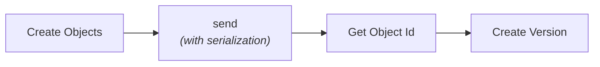
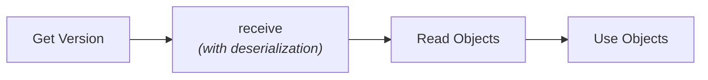

## The Speckle Data Model

Speckle uses an **object-based** approach rather than a file-based one. This is a fundamental shift from traditional CAD/BIM workflows.

<CardGroup cols={2}>
  <Card title="Traditional (File-Based)" icon="file">
    - Data locked in files (.rvt, .3dm, .ifc)
    - Full file transfer required
    - Version control through file copies
    - Large files, slow transfers
  </Card>

  <Card title="Speckle (Object-Based)" icon="cube">
    - Data is individual objects
    - Incremental transfers (only changes)
    - Built-in version control
    - Fast, efficient streaming
  </Card>
</CardGroup>

## Key Concepts

### 1. Objects

Everything in Speckle is an **object** that inherits from the `Base` class.

```python lines icon="python"
from specklepy.objects import Base
from specklepy.objects.geometry import Point

# All Speckle objects inherit from Base
point = Point(x=10, y=20, z=5)

# Base allows dynamic properties (added after creation)
custom = Base()
custom.name = "My Object"
custom.data = [1, 2, 3]
custom.nested = Base()
custom.nested.value = 42
```

<Info>
Objects are **immutable** once sent - their hash (object ID) uniquely identifies their content.
</Info>

#### Static vs Dynamic Properties

Speckle objects support both **static** (typed) and **dynamic** (untyped) properties. Static properties are defined in the class with type hints and provide IDE autocomplete, while dynamic properties can be added at runtime for application-specific data.

```python lines icon="python"
from specklepy.objects.geometry import Point

# Static properties (defined in class)
point = Point(x=1.0, y=2.0, z=3.0)

# Dynamic properties (added at runtime)
point.custom_id = "POINT_001"
point.metadata = {"author": "Alice"}
```

<Info>
Learn more about [Static vs Dynamic Properties](/developers/sdks/python/concepts/objects#static-vs-dynamic-properties) including type checking, required vs optional properties, and how to work with both types.
</Info>

### 2. Projects, Models, and Versions

Speckle organizes data in a three-level hierarchy:

```
Project
  └─ Model
      └─ Version
          └─ Object (Root object + children)
```


**Projects** are top-level containers for related work.

- Contain multiple models
- Have members with roles (owner, contributor, reviewer)
- Unique ID and name

```python lines icon="python"
from specklepy.core.api.inputs.project_inputs import ProjectCreateInput

project = client.project.create(ProjectCreateInput(
    name="Office Building Renovation",
    description="Main project for the renovation"
))
project_id = project.id
```


**Models** are branches within a project, representing different variants or disciplines.

- Examples: "site-boundary", "design-option-a", "structural", "MEP"
- Each model has its own version history

```python lines icon="python"
from specklepy.core.api.inputs.model_inputs import CreateModelInput

model = client.model.create(CreateModelInput(
    project_id=project_id,
    name="Structural Model",
    description="Structural analysis model"
))
model_id = model.id
```

**Versions** are snapshots of data at a point in time.

- Immutable - cannot be changed after creation
- Reference a root object by its ID (hash)
- Have a message describing the changes
- Include metadata (author, timestamp, source application)

```python lines icon="python"
from specklepy.core.api.inputs.version_inputs import CreateVersionInput

version_input = CreateVersionInput(
    project_id=project_id,
    model_id=model_id,
    object_id=object_id,
    message="Updated beam sizing"
)
version = client.version.create(version_input)
```


### 3. Object IDs (Hashes)

Every object has a unique **object ID** (also called a hash) that's deterministically generated from its content.

```python lines icon="python"
from specklepy.objects.geometry import Point

# Same content = same ID
p1 = Point(x=1, y=2, z=3)
p2 = Point(x=1, y=2, z=3)

print(p1.get_id())  # "abc123..."
print(p2.get_id())  # "abc123..." - same!

# Different content = different ID
p3 = Point(x=1, y=2, z=4)
print(p3.get_id())  # "xyz789..." - different!
```

<Check>
This enables:
- **Deduplication** - Identical objects stored once
- **Incremental sync** - Only new/changed objects transferred
- **Content addressing** - Objects referenced by their hash
</Check>

### 4. Transports

**Transports** are the mechanism for moving objects between locations.

<Tabs>
  <Tab title="ServerTransport" icon="server">
    Communicates with Speckle Server

    ```python lines icon="python"
    from specklepy.transports.server import ServerTransport

    transport = ServerTransport(
        project_id=project_id,
        client=client
    )
    ```
  </Tab>

  <Tab title="SQLiteTransport" icon="database">
    Local persistent cache

    ```python lines icon="python"
    from specklepy.transports.sqlite import SQLiteTransport

    transport = SQLiteTransport()
    # Stores in ~/.local/share/Speckle
    ```
  </Tab>

  <Tab title="MemoryTransport" icon="memory">
    In-memory storage for testing

    ```python lines icon="python"
    from specklepy.transports.memory import MemoryTransport

    transport = MemoryTransport()
    # Cleared when program ends
    ```
  </Tab>
</Tabs>

### 5. Operations: Send and Receive

The `operations` module provides the core functions for data transfer.

#### send()

Serializes an object and sends it via transports:

```python lines icon="python"
from specklepy.api import operations
from specklepy.transports.server import ServerTransport

transport = ServerTransport(stream_id=project_id, client=client)

# Send returns the object ID
object_id = operations.send(
    base=my_object,
    transports=[transport]
)
```

<Info>
`send()` automatically handles:
- Object serialization
- Child object detection
- Chunking large arrays
- Deduplication
- Parallel uploads
</Info>

#### receive()

Receives an object by its ID:

```python lines icon="python"
# Receive from server
received_object = operations.receive(
    obj_id=object_id,
    remote_transport=transport
)

# Data is automatically reconstructed
print(received_object.some_property)
```

### 6. Serialization

Objects are serialized to JSON for storage and transport:

```python lines icon="python"
from specklepy.api import operations

# Serialize to JSON string
json_string = operations.serialize(my_object)

# Deserialize from JSON string
reconstructed_object = operations.deserialize(json_string)
```

<Info>
Most developers won't need to know the serialization and deserialization functions directly. The `send()` and `receive()` operations handle serialization and deserialization implicitly. Use these functions only when you need custom workflows like saving objects to files or working with JSON representations directly.
</Info>

<Note>
Serialization automatically handles:
- Nested objects (converted to references)
- Large arrays (chunked and detached)
- Type information (preserved via `speckle_type`)
- Units (tracked and converted)
</Note>

### 7. Orphaned Objects

<Warning>

Objects sent to the server but not referenced by any version are called "orphaned" or "zombie" objects. While they exist in the database and have object IDs, they are effectively **unreachable** and cannot be browsed or retrieved through the normal Speckle UI or workflows.
</Warning>

```python lines icon="python"
# This object is sent but becomes orphaned
object_id = operations.send(base=my_object, transports=[transport])
# ⚠️ Without creating a version, this object is a "zombie"

# Make it reachable by creating a version
version = client.version.create(CreateVersionInput(
    project_id=project_id,
    model_id=model_id,
    object_id=object_id,  # Now reachable via this version
    message="My data"
))
```

**Key Points:**
- Orphaned objects remain in the database but are not discoverable
- You can still retrieve them if you have the object ID: `operations.receive(obj_id=object_id)`
- Always create a version after sending important data
- The server may eventually clean up orphaned objects (implementation-dependent)

## The Object Lifecycle

Here's how objects flow through a typical workflow:

### Send Workflow



### Receive Workflow



<Steps>
  <Step title="Create">
    Create Python objects using specklepy classes

    ```python lines icon="python"
    point = Point(x=1, y=2, z=3)
    ```
  </Step>

  <Step title="Send">
    Send objects via a transport

    ```python lines icon="python"
    object_id = operations.send(base=point, transports=[transport])
    ```
  </Step>

  <Step title="Version">
    Create a version referencing the object

    ```python lines icon="python"
    from specklepy.core.api.inputs.version_inputs import CreateVersionInput

    version_input = CreateVersionInput(
        project_id=project_id,
        model_id=model_id,
        object_id=object_id,
        message="Description of changes"
    )
    version = client.version.create(version_input)
    ```
  </Step>

  <Step title="Get Version">
    Retrieve a version to access its data

    ```python lines icon="python"
    # Get the version by ID
    version = client.version.get(project_id=project_id, version_id=version.id)

    # Access the referenced object ID
    object_id = version.referencedObject
    ```
  </Step>

  <Step title="Receive">
    Receive objects by ID

    ```python lines icon="python"
    received = operations.receive(obj_id=object_id, remote_transport=transport)
    ```
  </Step>
</Steps>

## The Type System

Speckle uses a type system to preserve object types across different platforms:

```python lines icon="python"
from specklepy.objects.geometry import Point

point = Point(x=1, y=2, z=3)

# Every object has a speckle_type
print(point.speckle_type)  # "Objects.Geometry.Point"

# This allows proper deserialization
received = operations.receive(...)  # Comes back as Point, not Base
```

### Built-in Types

<AccordionGroup>
  <Accordion title="Geometry (Objects.Geometry.*)">
    - Point, Vector, Line, Polyline, Arc, Circle
    - Curve, Polycurve, Mesh, Brep
    - Plane, Box, Surface
    
    ```python lines icon="python"
    from specklepy.objects.geometry import Point, Line, Mesh
    ```
  </Accordion>
  
  <Accordion title="Structural (Objects.Structural.*)">
    - Node, Element1D, Element2D, Element3D
    - Property1D, Property2D, Property3D
    - LoadCase, LoadBeam, LoadFace
    - Material, Concrete, Steel
    
    ```python lines icon="python"
    from specklepy.objects.structural.geometry import Node, Element1D
    from specklepy.objects.structural.materials import Concrete
    ```
  </Accordion>
  
  <Accordion title="Other (Objects.Other.*)">
    - Material, RenderMaterial
    - Transform, BlockInstance
    - Collection, View
    
    ```python lines icon="python"
    from specklepy.objects.other import Material, Transform
    ```
  </Accordion>
  
  <Accordion title="GIS (Objects.GIS.*)">
    - GisPoint, GisLineElement
    - VectorLayer, RasterLayer
    - CRS (Coordinate Reference Systems)
    
    ```python lines icon="python"
    from specklepy.objects.GIS.geometry import GisPoint
    ```
  </Accordion>
</AccordionGroup>

### Custom Types

You can create your own types:

```python lines icon="python"
from specklepy.objects import Base

class Wall(Base, speckle_type="MyCompany.Wall"):
    height: float
    thickness: float
    material: str

wall = Wall(height=3.0, thickness=0.2, material="Concrete")
print(wall.speckle_type)  # "MyCompany.Wall"
```

## Local Cache

specklepy maintains a local SQLite cache:

- **Location**: 
  - Windows: `%APPDATA%\Speckle`
  - macOS: `~/.config/Speckle`
  - Linux: `~/.local/share/Speckle`

- **Purpose**:
  - Cache received objects for faster access
  - Enable offline work
  - Reduce network transfers

- **Automatic**: Used by default in `send()` and `receive()`

```python lines icon="python"
# By default, objects are cached locally
object_id = operations.send(
    base=my_object,
    transports=[server_transport],
    use_default_cache=True  # Default
)

# Skip cache if needed
object_id = operations.send(
    base=my_object,
    transports=[server_transport],
    use_default_cache=False
)
```

## Next Steps

Now that you understand the concepts, explore the API and apply your knowledge:

<CardGroup cols={2}>
  <Card title="API Reference" icon="code" href="/developers/sdks/python/api-reference/client">
    SpeckleClient, resources, and operations API
  </Card>
  
  <Card title="Objects & Base" icon="cube" href="/developers/sdks/python/concepts/objects">
    Deep dive into the Base class and object model
  </Card>
  
  <Card title="Traversing Objects" icon="diagram-project" href="/developers/sdks/python/guides/traversing-objects">
    Learn to navigate and extract data from object graphs
  </Card>
  
  <Card title="Data Types" icon="table" href="/developers/sdks/python/concepts/data-types">
    Understanding the three types of Speckle data
  </Card>
</CardGroup>
