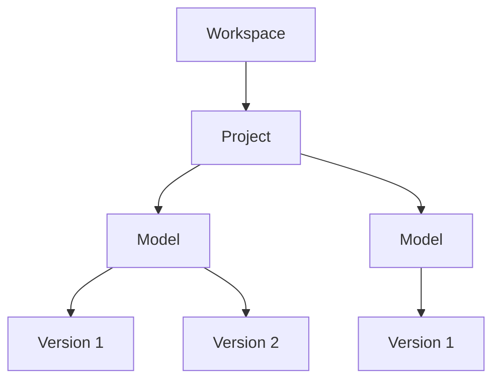

## What is a Workspace?

A Workspace provides a secure, centralised environment for your team to collaborate, manage projects, and control access to shared data.  

## Key Features of Workspaces

Workspaces are designed to:

- Enable granular access control for projects and team members.
- Provide domain-based membership protection for enhanced security.
- Support team collaboration with centralised project and user management.
- Streamline project workflows and data sharing.
- Allow for collaboration and team development of automations with Speckle Automate.
- Explore the Starter or Business plans for increased usaged limits and advanced functionality like Single Sign-On (SSO) or custom data residency.

## Managing Access and Permissions

Workspaces offer flexible access controls to fit your organisation's needs:

.....more soon (simple diagram here)

## Security
### Single Sign-On (SSO)

## Data residency

### People & Roles

#### Admin
....

#### Editor
...

#### Viewer
...

#### Guest
...

## Workspaces for Companies

### Verified Domains
To customise your workspace and make it visible to your entire team, you can verify an email domain associated with your account:

1. Select your workspace from the sidebar.
2. Go to the Settings tab.
3. Add a new domain. This will include all email domains you’ve verified for your account.

### Workspace protection
Enabling Domain Protection for your workspace ensures that only users with verified email domains can join your workspace.

- You can still invite external users to specific projects within your workspace.
- However, these users will not have visibility of other projects in the workspace unless explicitly invited.

### Workspace Discoverability
If you mark your workspace as discoverable, this will notify team members using the same Speckle server that your workspace exists and that they can request to join.

- This option provides a low-friction way to allow team members to join your workspace.
- Note: For paid plans, each new member added to your workspace will be billed to your account.

## Learn more

<CardGroup cols={2}>
  <Card
    title="Projects & Models"
    icon="folder-open"
    href="https://mintlify.com/docs/quickstart"
  >
    Get your docs set up locally for easy development
  </Card>
  <Card
    title="Connector Settings"
    icon="plug"
    href="https://mintlify.com/docs/development"
  >
    Preview your changes before you push to make sure they're perfect
  </Card>
    <Card
    title="Connectors"
    icon="table-columns"
    href="https://mintlify.com/docs/development"
  >
    Preview your changes before you push to make sure they're perfect
  </Card>
    <Card
    title="Automate"
    icon="arrows-rotate"
    href="https://mintlify.com/docs/development"
  >
    Preview your changes before you push to make sure they're perfect
  </Card>
</CardGroup>
