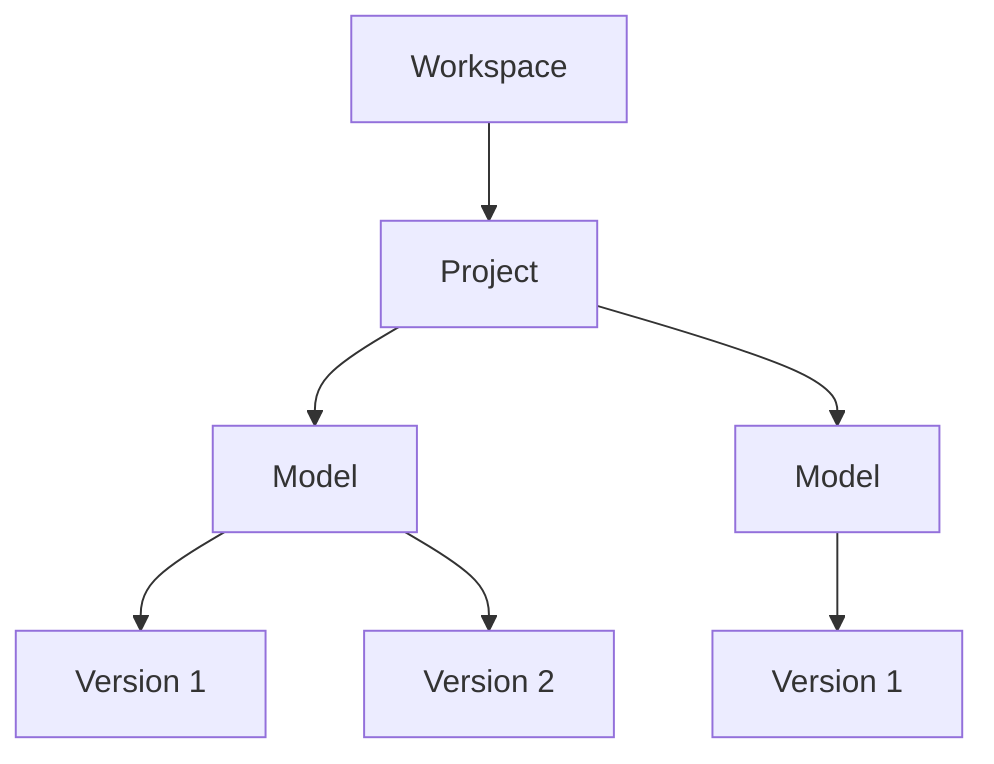

## What is a Workspace?

A Workspace provides a secure, centralised environment for your team to collaborate, manage projects, and control access to shared data.  

## Key Features of Workspaces

Workspaces are designed to:

- Enable granular access control for projects and team members.
- Provide domain-based membership protection for enhanced security.
- Support team collaboration with centralised project and user management.
- Streamline project workflows and data sharing.
- Allow for collaboration and team development of automations with Speckle Automate.
- Explore the Starter or Business plans for increased usaged limits and advanced functionality like Single Sign-On (SSO) or custom data residency.

