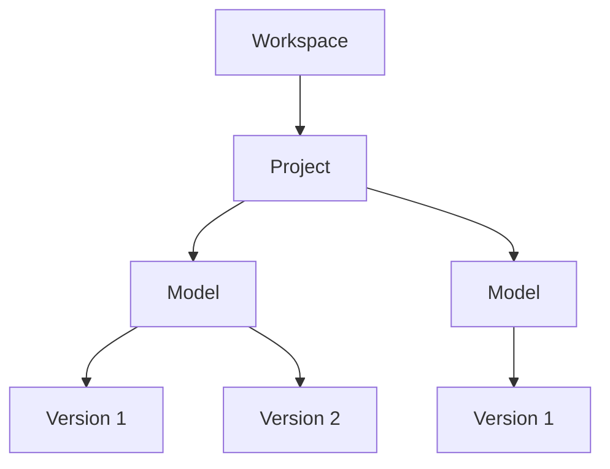

## What is a Workspace?

A workspace is an organizational structure for your teams’ projects and models.
It provides a secure, centralized environment for managing roles, permissions, and data access.
Workspaces are flexible and customizable, with optional plans and add-ons to meet your needs.

<Frame>

</Frame>

### Organization

## Key Features of Workspaces

Workspaces are designed to:

- Enable granular access control for projects and team members.
- Provide domain-based membership protection for enhanced security.
- Support team collaboration with centralized project and user management.
- Streamline workflows and data sharing.
- Allow for collaborative development of automations with Speckle Automate.
- Offer flexible plans with advanced features like Single Sign-On (SSO) and custom data residency.

## Workspace Plans

Speckle offers workspace plans to fit every need:

- Small teams with many projects and models.
- Organizations needing data residency within specific territories.
- Enterprises managing large numbers of users and projects.

For an up-to-date list of plans and features, visit [our main website](https://www.speckle.systems/pricing).

## Explore Further
Use the sidebar to learn more about managing projects, inviting users, setting roles, 
and ensuring data security in your workspace.

